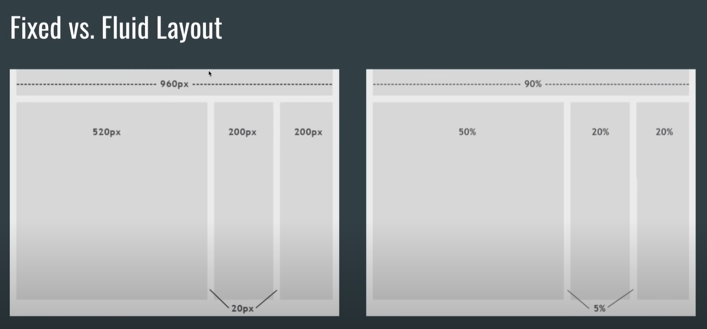

# Responsive Web Design

## Apa itu responsive web design ?

Responsive Web Design adalah sebuah pendekatan yang menyarankan agar proses perancangan dan pembangunan sebuah web app harus merespon terhadap perilaku pengguna berdasarkan dari ukuran layar, platform dan orientasi layar.

Ukuran Layar terbagi menjadi:
* Smartphone
* Tablet
* Laptop
* Desktop

Orientasi Layar terbagi menjadi:
* Landscape
* Portrait

Tetapi selain itu setiap tipe dari tiap layar dan merk memiliki ukuran layar yang berbeda-beda.

## Prinsip - prinsip web responsive design

### 1. Adaptive vs Responsive Design

Dari ilustrasi diatas jika kita menggunakan prinsip adaptive, maka kita akan membuat 4 layout sesuai dengan target device yang diinginkan. Disebut adaptive dikarenakan kita yang mengadaptasi lebar layar terhadap layout kita. Hasil dari adaptive ini akan sangat bagus karena kita spesifik sekali membuat suatu layout untuk suatu lebar layar. Tetapi masalahnya suatu layout tersebut tidak akan bisa mengcover semua lebar layar yang ada.

Sedangkan dalam konsep responsive kita hanya membuat satu layout tetapi responsive terhadap lebar layarnya. 

### 2. Viewport dan Viewport Meta Tag

**Viewport** adalah area pada halaman web yang terlihat user.

Ilustrasi diatas menunjukkan biasanya kita melakukan suatu kesalahan yaitu dimana ada elemen yang berada diluar viewport. Hal ini boleh dilakukan jika memang ingin sengaja menyembunyikan suatu elemen, contohnya yaitu untuk slide show.

**Viewport Meta Tag** adalah suatu meta tag yang perlu kita tambahkan ketika kita ingin membuat suatu website bersifat responsive. Meta tag ini biasanya kita tambahkan ketika kita membuat layout tanpa menggunakan framework.

Meta Tag ini kita taruh pada element head.

### 3. Breakpoints

Breakpoints adalah titik - titik ukuran lebar layar yang biasanya kita gunakan sebagai patokan ketika mengubah desain kita.

### 4. Media Query

Breakpoints yang disebutkan tadi akan digunakan dalam media query. Media Query digunakan sebagai dasar untuk membuat layout responsive. Media Query ini kita gunakan dalam CSS.

### 5. Fluid Layouts

Ketika kita memakai fixed layout kita menggunakan absolute units sebagai ukurannya hal ini membuat layout yang kita buat bersifat baku. Sedangkan untuk fluid layout kita lebih sering menggunakan relative units seperti percentage.

### 6. Relative Units

Untuk mengimplement fluid layout kita harus mengerti beberapa relative units seperti :
* %
* rem & em
* vw & vh
* vmin & vmax

### 7. Responsive Media

Sama dengan halnya layout ketika mendeklarasikan ukuran media seperti gambar dan video kita gunakan relative units dibandingkan dengan absolute units.

### 8. Flexbox

Flexbox adalah salah satu cara layouting terbaru yang dapat digunakan untuk responsive web design.

### 9. Grid

Grid adalah cara layouting terbaru yang lebih tricky daripada menggunakan flexbox.

### 10. Mobile First Design

Menurut penelitian-penelitian yang ada jika kita melakukan web design lebih baik kita membuat design untuk mobile dulu kemudian baru bergerak perlahan ke desain yang lebih besar.

Reference : [Responsive Web Design](https://www.youtube.com/watch?v=jEGPKL7n4Uw)