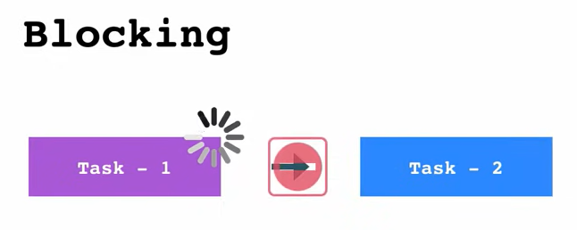
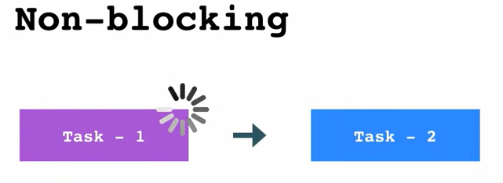
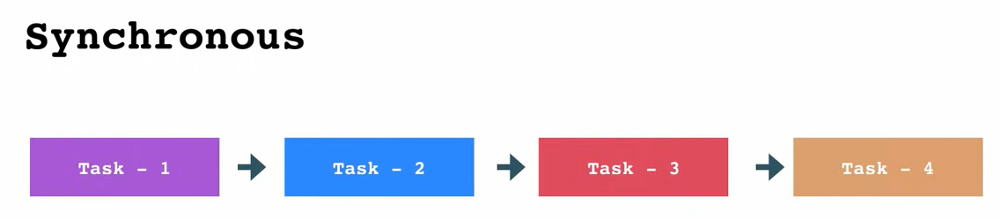
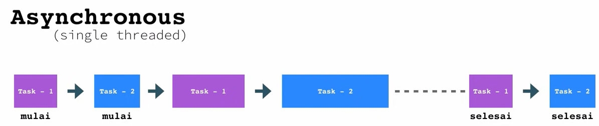
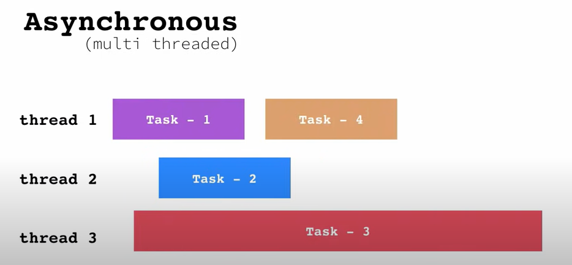
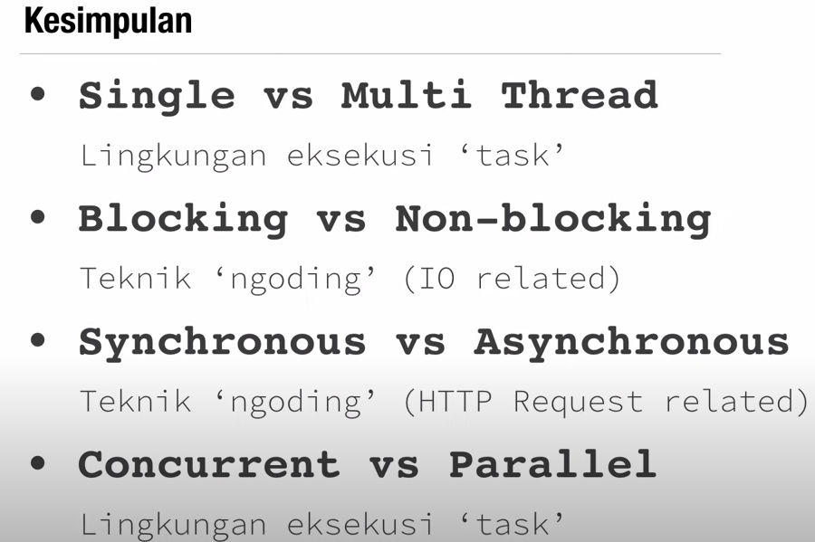

# Asynchronous Javascript

## Penjelasan Javascript

Javascript sebenarnya juga memiliki pengertian lain yaitu

`Javascript is a single-threaded, non-blocking, asynchronous and concurrent language`  by http://latentflip.com/

Pembahasan beberapa maksud dari pengertian tersebut adalah sebagai berikut:

### A. Single Threaded dan Multi Threaded

Kita mulai dari pengertian thread. Thread adalah urutan eksekusi kode yang dapat dilakukan secara bebas/independent satu sama lain. Jadi maksudnya Javascript Single Threaded adalah Javascript hanya bisa melakukan satu hal pada satu waktu tertentu.

Ilustrasi Single Thread diatas menunjukkan bahwa suatu task akan bisa dijalankan setelah task yang lainnya telah selesai.

Sedangkan untuk Multi Threaded, thread nya bisa banyak tetapi secara umum pekerjaan yang dilakukan juga satu persatu tetapi dapat dilakukan oleh thread yang berbeda-beda.

### B. Blocking dan Non-Blocking

Penjelasan dari Blocking dan Non-Blocking akan dijelaskan menggunakan illustrasi dibawah: 

Pada illustrasi diatas digambarkan bahwa Task-1 mengalami proses yang lama, karena bersifat Blocking maka Task-2 tidak akan dijalankan sebelum Task-1 selesai.

Beda hal dengan Non-Blocking walaupun Task-1 belum selesai eksekusinya, kita bisa tetap menjalankan Task selanjutnya.

### C. Synchronous dan Asynchronous

Untuk Synchronous adalah proses task seperti biasa yaitu berurutan.

Sedangkan untuk Asynchronous terbagi menjadi dua yaitu:

a. Asynchronous Single Threaded

Pada asynchronous single threaded seperti illustrasi diatas, thread akan memulai Task-1 terlebih dahulu kemudian dia akan memulai Task-2. Kembali lagi mengerjakan Task - 1 dan kemudian ke Task-2. Sampai akhirnya kedua task tersebut selesai.

b. Asynchronous Multi Threaded

Sedangkan pada asynchronous multi threaded seperti illustrasi diatas, setiap thread akan menjalankan tasknya masing-masing secara bersamaan.

Untuk penyebutan lain dari kedua jenis Asynchronous tersebut adalah seperti dibawah ini:

### Kesimpulan

Kesimpulan dari semua penjelasan tadi adalah:  
#### a. Ketika membahas tentang Single VS Multi Thread itu ada hubungannya dengan lingkungan eksekusi tasknya yaitu berapa thread yang dipakai untuk mengeksekusi task. 
 
#### b. Sedangkan Blocking VS Non-Blocking berhubungan dengan teknik mengoding kita yang berhubungan dengan IO ( Input Output ). Seperti apakah suatu tombol akan melakukan prosesnya secara blocking sehingga menghambat semua proses selanjutnya atau sebaliknya.

#### c. Sama seperti Blocking VS Non-Blocking, Synchronous VS Asynchronous ini berhubungan dengan teknik mengoding tapi lebih soal HTTP Request. Seperti AJAX dll.

#### D. Concurrent VS Parallel juga tentang lingkungan eksekusi task yang berhubungan dengan infraktruktur yang dipakai seperti hardware .  
 

`Penjelasan Lebih Dalam tentang Engine yang digunakan Javascript`
https://www.youtube.com/watch?v=wVtdv5BHhno&list=PLFIM0718LjIUGpY8wmE41W7rTJo_3Y46-&index=20`

   
 
### [Back To ES6 Index](./README.md)