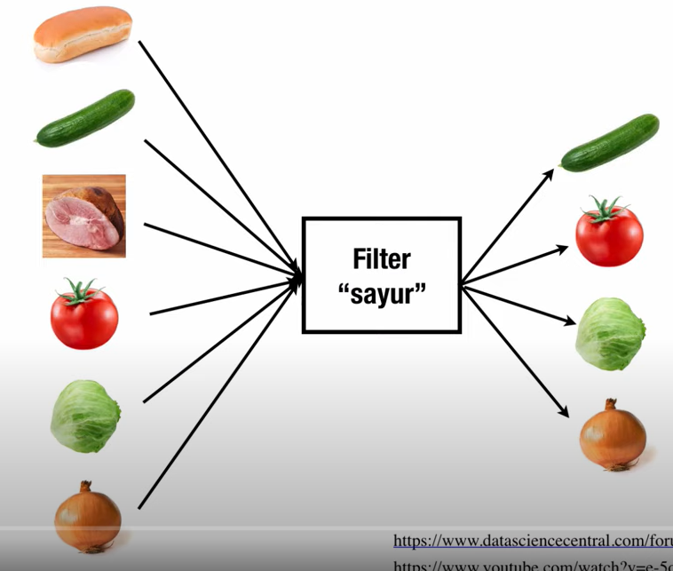
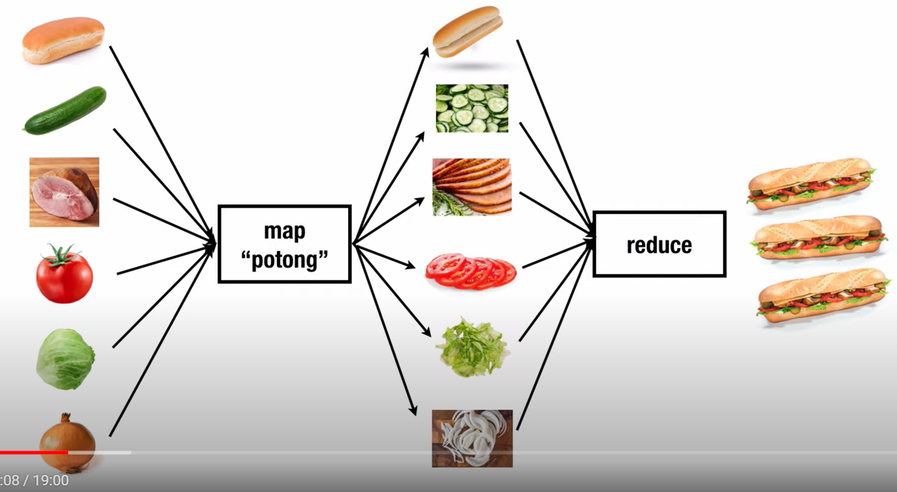

# Filter, Map dan Reduce

Filter, Map dan Reduce merupakan `Higher Order Function` yang sering dipakai pada javascript.

## A. Filter



Filter merupakan salah satu `Higher Order Function` yang memiliki fungsi seperti namanya yaitu melakukan filter terhadap sebuah array dengan sebuah kondisi dan akan mengembalikan array lain hasil filter kondisi tersebut. Pada ilustrasi diatas digambarkan array bahan makanan yang diberi fungsi `filter` sayur, sehingga mengembalikan array baru yang memenuhi kondisi bahwa dia bahan makanan bertipe sayur.  

Contoh:

```js
const angka = [-1, 8, 9, 1, 4, -5, -4, 3, 2, 9];

const newAngka = angka.filter(a => a >= 3);
```

Hasil dari array diatas adalah menghasilkan array baru dengan angka lebih besar dari 3.
<br />



## B. Map

Map memiliki fungsi yaitu melakukan sebuah aksi terhadap suatu array dan akan mengembalikan array lain yang berisi hasil dari sebuah aksi tersebut. Contoh pada 
ilustrasi diatas adalah array bahan makanan diberi aksi `map` yaitu potong sehingga menghasilkan array baru berisi hasil bahan makanan yang telah dipotong. Perbedaan `map` dan `foreach` adalah `map` mengembalikan nilai yaitu array baru sedangkan foreach tidak mengembalikan array baru.  

Contoh:
```js
const angka = [-1, 8, 9, 1, 4, -5, -4, 3, 2, 9];

const newAngka = angka.map(a => a * 2);
```

Hasil dari array diatas adalah menghasilkan array baru dengan angka awal yang sudah dikali dengan 2.
<br />

## C. Reduce

Reduce memiliki fungsi untuk mengkombinasikan seluruh isi dari array. Seperti yang dapat dilihat pada ilustrasi diatas hasil bahan makanan yang telah dipotong diberi function `reduce` sehingga menghasilkan sandwich.

Contoh:
```js
const angka = [-1, 8, 9, 1, 4, -5, -4, 3, 2, 9];

const newAngka = angka.reduce((accumulator, currentValue) => accumulator + currentValue)
```

Pada contoh diatas dilakukan penjumlahan terhadap seluruh elemen array. Reduce memiliki dua argumen yaitu `accumulator` dan `currentValue`. `Accumulator` ini menandakan hasil saat ini dari elemen yang sedang di looping, sedangkan untuk `currentValue` sendiri menandkan berapa value yang sedang diloop.

Semisal pada array diatas
Awalnya `accumulator` memiliki nilai 0 dan ketika currentValue berada di -1 maka `accumulator` menjadi -1 karena -1 + 0 = -1. Dan seterusnya.  
<br />
<br />
## Method Chaining

Method - method pada `Higher Order Function` dapa dilakukan method chaining dalam penggunaannya. Method chaining adalah penggunaan dua fungsi atau lebih dalam melakukan sebuah proses.

Contoh:

> Sebuah kasus membutuhkan suatu array agar diproses menjadi seperti berikut:<br/>
> 1. Cari angka > 5
> 2. Kalikan 3
> 3. Jumlahkan Semua

Code yang dilakukan adalah:

```js
const angka = [-1, 8, 9, 1, 4, -5, -4, 3, 2, 9];

const hasil = angka
.filter(a => a > 5)
.map(a => a * 3)
.reduce((accumulator, currentValue) => accumulator + currentValue);
```