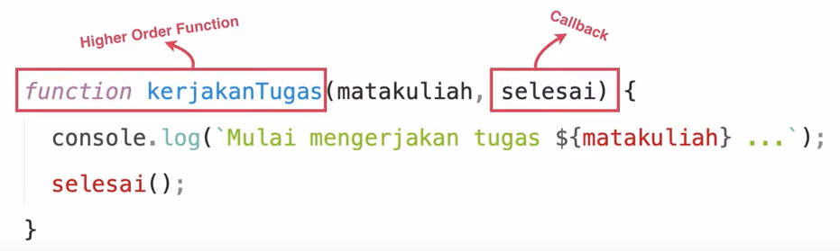

# Higher Order Function

Pengertian dari Higher Order Function adalah function yang beroperasi pada function yang lain. Baik itu digunakan dalam argument maupun sebagai return value.

Contoh:

```js
function kerjakanTugas (matakuliah, selesai){
    console.log(`Mulai mengerjakan tugas ${mataKuliah}`);
    selesai();
}

function selesai(){
    alert(`Selesai mengerjakan tugas!`);
}

kerjakanTugas('Pemrograman Web', selesai);
```



Pada contoh diatas `function kerjakan tugas()` merupakan Higher Order Function karena dia mempunyai `function selesai()` sebagai argumennya. Dan dalam kasus ini `function selesai()` disebut sebagai Callback karena digunakan sebagai argumen.

Contoh Lain:

```js
setTimeout(function() {
    console.log('Hello World')
}, 1000)
```

Pada function setTimeout menerima dua argumen yaitu salah satu nya adalah fungsi. Sehingga function `setTimeout` juga dapat disebut sebagai Higher Order Function.

```js
function ucapkanSalam(waktu){
    return function (nama) {
        console.log(`Halo`)
    }
}

let selamatMalam = ucapkanSalam('Malam');

console.log(selamatMalam('Sandhika'));
```

Pada function diatas juga disebut sebagai Higher Order Function dikarenakan `function ucapkanSalam()` memiliki return `function` yang lain.  
<br/>
<br/>  
## Kenapa adanya Higher Order Function ?  

> Semakin besar sebuah program, semakin tinggi kompleksitasnya, semakin membingungkan programernya.  
> eloquentjavascript.net

Artinya dengan seiring semakin besar programnya maka code yang kita tulis akan semakin banyak sehingga daripada kita membuat suatu `block scope` yang berisi banyak code. Lebih baik kita membuat `fucntion` sesuai dengan tujuannya dan kita dapat memanggilnya melalui `function` yang lain `(Higher Order Function)`.

Contoh Higher Function dan Function Biasa:

```js
Fungsi Biasa

let total = 0, count = 1;
while(count <= 0){
    total += count;
    count += 1;
}
console.log(total);
```

VS

```js
Higher Order Function

console.log(sum(range(1, 10)))
```

Pada `Higher Order Function` kita bayangkan mempunyai function bernama `sum()` yang mempunyai parameter function lain bernama `range()`. Dari penulisan `function` ini lebih mudah untuk programmer lain membaca daripada memakai `function` yang biasa.  
  
### Contoh Evolusi Function

1. Function Biasa
```js
function repeat(){
    for(let i = 0; i < 10; i++){
        console.log(i);
    }
}
```

2. Function dengan parameter
```js
function repeat(n){
    for(let i = 0; i < n; i++){
        console.log(i);
    }
}
```

3. Higher Order Function
```js
function repeat(n, action){
    for(let i = 0; i < n; i++){
        action(i);
    }
}

repeat(10, console.log);
repeat(3, alert);
```

### [Back To ES6 Index](./README.md)