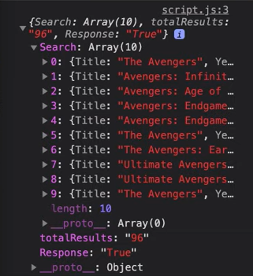
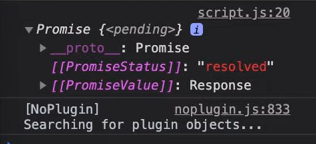

# Promise

Sebelum pembahasan promise, dibawah ini ada beberapa contoh cara memanggil API untuk melakukan fetch data.

## A. Pengertian Promise
### 1. Menggunakan Ajax

```js
// Untuk menggunakan ajax kita butuh memanggil library ajax yang dapat kita download dari website resminya.Kemudian setelah kita panggil kita dapat gunakan seperti diabwah ini.

$.ajax({
   url: 'http://www.omdbapi.com/?apikey=dca61bcc&s=avengers',
   sucess: movies => console.log(movies), 
});
```

### 2. Menggunakan Vanilla Javascript

```js
// Kita dapat menggunakan vanilla javascript tanpa bantuan ajax seperti dibawah ini:

const xhr = new XMLHttpRequest();
xhr.onreadystatechange = function(){
    if(xhr.status === 200){
        if(xhr.readyState === 4){
            // response yang didapat berbentuk teks sehingga kita harus mengubah menjadi JSOn
            console.log(JSON.parse(xhr.response));
        }
    }else{
        console.log(xhr.responseText);
    }
}
```


Hasil dari console.log menggunakan AJAX maupun Vanilla JAvascript diatas adalah:  


### 3. Menggunakan Fetch

Ada cara baru memanggil API yaitu menggunakan fetch, tetapi hasil console.log fetch ini akan menghasilkan `Promise`.

```js
const movies = fetch('http://www.omdbapi.com/?apikey=dca61bcc&s=avengers');
console.log(movies);
```



<br />

Sebelum ke Fetch kita akan kembali ke Promise. Jadi Promise memiliki pengertian yaitu
`Object yang mempresentasikan keberhasilan / kegagalan sebuah event yang asynchronous di masa yang akan datang.`

Ada beberapa istilah yang harus diketahui dalam promise :  
a. Secara Definisi: Dalam definisi nya promise berarti janji sehingga dalam janji ada dua hal yang terjadi yaitu :
* Terpenuhi
* Ingkar

b. Nama Keadaan (States) : Dalam javascript Promise memiliki beberapa states yaitu :
* Fullfilled : Terpenuhi
* Rejected : Diingkari
* Pending : Ketika waktu menunggu terpenuhi atau diingkari

c. Fungsi - fungsi callback : Sesuai dengan states yang ada, ada 3 call back yang harus kita berikan yaitu:
* Resolve : Fungsi yang dipanggil ketika Promise menerima states Fullfilled
* Reject : Fungsi yang dipanggil ketika Promise menerima states Rejected
* Finally : Fungsi yang dipanggil ketika Promise states Pendingnya selesai, finally akan dipanggil meskipun janjinya terpenuhi atau tidak terpenuhi

d. Aksi: ada beberapa aksi yang dapat kita lakukan ketika janjinya terpenuhi atau tidak terpenuhi. Aksi tersebut yaitu:
* then : Ketika janji terpenuhi, sehingga then akan menjalankan resolve
* catch : Ketika janji tidak terpenuhi, sehingga catch akan menjalankan reject

<br />

## B. Contoh Promise


### Contoh 1
```js
// Contoh 1 : Case Pertama ini adalah penulisan simple syntax promise
// Variable Ditepati adalah perumpamaan contoh hasil kondisi
let ditepati = true;

// Promise menerima dua fungsi call back yaitu resolve dan reject
const janji1 = new Promise((resolve, reject) => {
    if(ditepati){
        // Kita beri resolve jika kondisi terpenuhi
        resolve('Janji telah ditepati');
    } else {
         // Kita beri reject jika kondisi tidak terpenuhi
        reject('Ingkar Janji');
    }
});

janji1
    // Then akan memanggil response resolve jika promise terpenuhi
    .then(response => console.log('OK! : ' + response))
    // Then akan memanggil response reject jika promise tidak terpenuhi
    .catch(response => console.log('NOT OK! : ' + response));
```

### Contoh 2
```js
// Contoh 2: Case kedua ini adalah practice singkat menggunakan asynchronous
let ditepati2 = true;

// Promise menerima dua fungsi call back yaitu resolve dan reject
const janji2 = new Promise((resolve, reject) => {
    if(ditepati2){
        // Kita beri resolve jika kondisi terpenuhi tetapi setelah 2 detik
        setTimeout(() => {
            resolve('Janji telah ditepati');
        }, 2000)
    } else {
         // Kita beri reject jika kondisi tidak terpenuhi tetapi setelah dua detik
         setTimeout(() => {
            reject('Ingkar Janji');
        }, 2000)
    }
});

console.log('mulai');
janji2
    // Then akan memanggil response resolve jika promise terpenuhi
    .then(response => console.log('OK! : ' + response))
    // Then akan memanggil response reject jika promise tidak terpenuhi
    .catch(response => console.log('NOT OK! : ' + response));
    // Finally akan tetap dipanggil apapun hasil aksi yang didapat
    .finally(() => console.log('selesai menunggu'));
console.log('selesai');
```

### Contoh 3
```js
// Contoh 3: Case ketiga adalah penggunaan Promise.all
const film = new Promise(resolve => {
    setTimeout(() => {
        resolve([{
            judul: 'Avengers',
            sutradara: 'Yudistira Putra',
            pemeran: 'Doddy, Erik'
        }])
    }, 1000);
});

const cuaca = new Promise(resolve => {
    setTimeout(() => {
        resolve([{
            kota: 'Bandung',
            temp: 26,
            kondisi: 'Cerah Berawan'
        }])
    }, 500);
});

// Jika mau menjalankan promise sendiri-sendiri kita bisa mennggunakan seperti dibawah
// Hasil promisenya akan tampil sesuai waktu tampilnya sendiri-sendiri
film.then(response => console.log(response));
cuaca.then(response => console.log(response));

// Tetapi jika ingin memanggil response bersamaan kita bisa menggunakan Promise.all
Promise.all([film, cuaca])
    .then(response => console.log(response))
// atau menggunakan spread untuk langsung memecah variablenya
    .then(response => {
        const [film, cuaca] = response;
    })
```