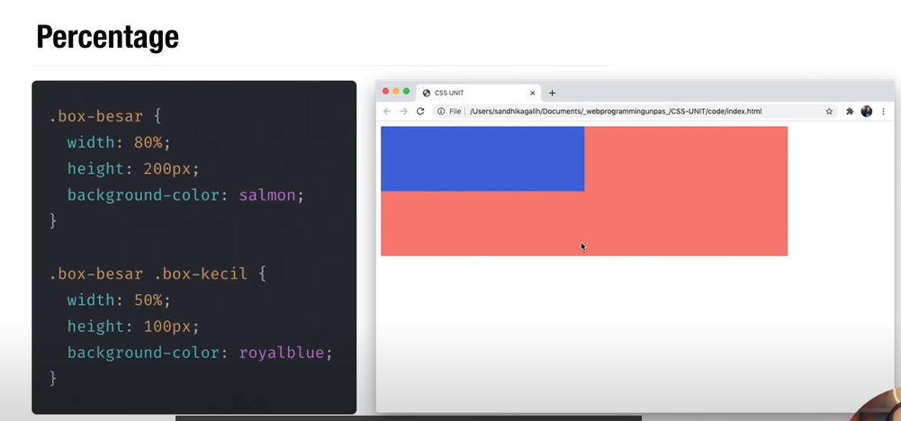
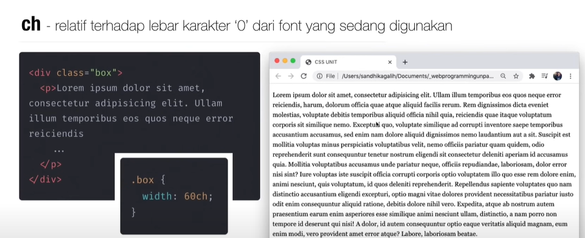

# CSS Value & Unit

CSS value dan unit dapat diartikan yaitu nilai dan satuan yang dapat digunakan dalam properties dalam CSS.

## A. CSS Value

CSS Value dapat diisi dengan beberapa tipe data yaitu:
* Integer
* Number
* Percentage
* Dimension

Berikut adalah penjelasan dari tipe-tipe data tersebut :

### 1. Integer

Tipe data integer adalah bilangan bulat yang nilainya bisa positif atau negatif.

Beberapa contoh diatas adalah css dengan value tipe data integer. Bilangan negatif seperti z-index digunakan untuk menentukan suatu elemen berada dibawah dari element html lainnya.

### 2. Number

Tipe data Number mengsupport bilangan pecahan.

Contoh penggunaan CSS value number seperti diatas adalah ketika menggunakan properti css opacity ( transparansi ) dan juga transform yang digunakan untuk animasi suatu elemen HTML.

### 3. Percentage

Tipe data percentage merepresentasikan sebagian dari nilai tertentu. % selalu relative terhadap nilai yang lain.

Penjelasan dari ilustrasi diatas adalah yang pertama div dengan class bernama `box besar` memiliki properti `width: 80%`, itu artinya div yang mempunyai `background-color: salmon` tersebut akan selalu memiliki lebar 80 persen dari div parentnya atau pembungkusnya. Kemudian sama halnya dengan div yang memmpunyai class bernama `box-kecil`, dia mempunyai property yaitu `width: 50%` yang berarti lebarnya akan selalu sebesar 50 persen dari div parentnya.

### 4. Dimension

Dimension adalah number yang memiliki satuan di belakangnya. Didalam dimension ini terbagi kembali menjadi beberapa  kategori yaitu:

a. Angle

CSS value dalam kategori dimensi angle digunakan untuk mempresentasikan suatu sudut.

Tipe - tipe Satuan Angle :

Rumus dalam Konversi Angle:

Contoh Code Angle CSS:

b. Time

CSS value dalam kategori dimensi time digunakan untuk menunjukkan durasi. Dimensi time ini biasanya digunakan untuk css bertipe animasi.

Tipe - tipe satuan Time :

Hanya ada dua satuan dalam time yaitu `second` ( detik ) dan `milisecond` ( mili detik ) dengan konversi 1 second sama dengan 1000 milisecond.

c. Resolution

CSS value dalam kategori dimensi resolution ini digunakan untuk menentukan resolusi tampilan website. Biasanya satuan ini digunakan ketika membuat website printing.

d. length

Didalam css value ini terdapat dua tipe lagi yaitu: 

* Absolute

Length absolute ini bersifat selalu tetap. Unit yang umum digunakan adalah px ( pixel ) dan sisanya unit yang lainnya hanya digunakan ketika membuat website yang ingin dicetak.

* Relative

Length Tipe Relative biasanya digunakan untuk membuat website yang bersifat responsive. Beberapa relative unit adalah seperti dibawah ini:

1. em

Unit ini biasa digunakan untuk font-size. Em bersifat relatif terhadap ukuran font yang sedang digunakan.

Bisa dilihat diatas font-size yang menggunakan em akan mengikuti font-size parentnya.

2. rem

Sama seperti em unit ini biasa digunakan untuk font-size. Rem bersifat relatif terhadap ukuran font dari root nya.

3. ch ( character )

Unit ch bersifat relatif terhadap lebar karakter '0' dari font yang sedang digunakan.

Hasil ketika setelah diberi width nya 60 ch yaitu seperti dibawah ini :

Bisa dilihat diatas setelah diberi css width 60 ch, ukuran width dari div class box adalah sekitar 60 karakter 0 untuk font yang sedang dipakai yaitu `Georgia`.
Penggunaan unit ch ini biasanya digunakan ketika kita ingin menentukan lebar dari suatu elemen yang digunakan sebagai placeholder berisi karakter.

4. vh & vw

