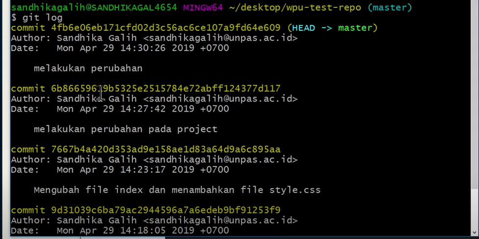
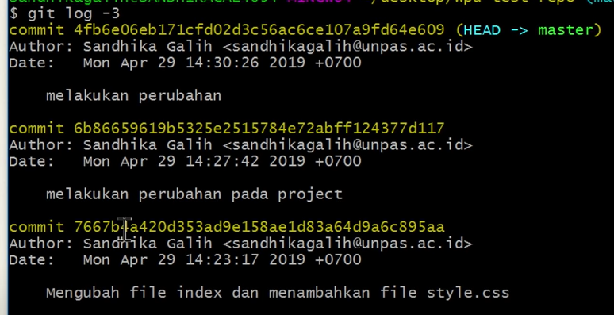
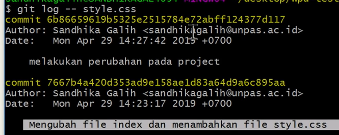
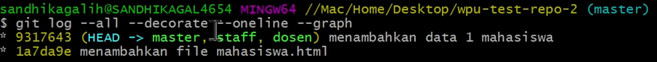

# Git Advanced Command

## 1. Git Config

Digunakan untuk melakukan perubahan nilai pada configurasi Git pada level Global maupun Local.  

### Git Config Levels dan Files  
* --local

Secara default semua perubahan akan berada pada level ini. Konteks perubahan ini hanya di simpan kedalam repo local saja. Yaitu didalam repo pada file `.git/config`

* --global

Konfigurasi level global bersifat user-specific terhadap user pada operating system yang digunakan. Konfigurasi ini disimpan di `C:\Users\\.gitconfig` ( jika pada windows )

* --system

Konfugrasi level system akan di apply di seluruh repo dan user yang ada pada device yang digunakan. Konfigurasi ini disimpan pada `C:\ProgramData\Git\config` ( jika pada windows )  

### Contoh beberapa penggunaan :

1. Mengecek Semua Config
* `git config --list`
 
 

2.  Deklarasi username dan email
* `git config --global user.name "Yudistira Eka Putra"`
* `git config --global user.email "yudistira@tes.com"`
 
 

## 2. Git Log

Digunakan untuk melihat semua history commit yang dilakukan.

* Melihat history 3 teratas menggunakan `git log -3`

* Melihat history sebuah file menggunakan `git log -- style.css`

* Melihat history dalam bentuk graph ( seperti pada aplikasi GUI github ) menggunakan 

* `git log -all --decorate --oneline --graph`

 
 
## 3. Git Checkout Untuk mengembalikan file

Digunakan untuk kembali ke suatu keadaan commit yang telah dilakukan.

### A. Mengembalikan file yang telah dihapus pada commit
* Lihat history file yang ingin dikembalikan

* Lakukan Checkout sesuai dengan 5 character sebuah commit dan tentukan file yang ingin dikembalikan

