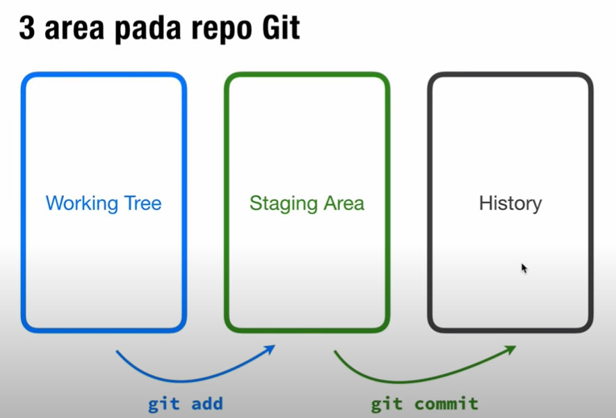

# Git Area

## 1. Working Tree / Local

* Area ini adalah dimana kita bekerja secara local pada komputer kita. Setelah kita selesai dan ingin melakukan push, langkah pertama yang kita lakukan adalah menambahkan file kita ke staging area menggunakan command `git add`  

## 2. Staging Area

* Area ini adalah dimana kita menempatkan file secara sementara sebelum kita melakukakan commit. Biasanya commit dilakukan tidak hanya pada satu file sehingga area ini akan tersedia untuk menampung semua file yang kita seleksi dalam satu commit. Kemudian untuk melakukan commit dari semua file yang ada pada staging area kita menggunakan command `git commit`  

## 3. History

* Area ini menampilkan commit - commit yang telah kita lakukan. Setelah semua commit kita sudah betul dan ingin kita push ke remote repo maka kita bisa menggunaka command `git push`  

### [Back To Notes Index](./README.md)

