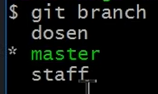

# Git Basic Command

## 1.  Git Init

Digunakan untuk mendeklarasikan suatu folder local sebagai repo git. Merupakan langkah pertama dari git.
    
Syntax: `git init`  
## 2. Git Status

Untuk melakukan pengecekan perubahan file pada folder repo. Tampilan yang muncul akan menunjukkan mana saja file yang belum ditrack ataupun file yang sudah ada di staging area.

Syntax: `git status`  
## 3. Git Add

Untuk melakukan staging file ke staging area. Staging area adalah dimana tempat file file ditampung sebelum dilakukannya commit.

Syntax: `git add .....`  

Untuk penggunaan lebih detail:

### A. Satu file Staging

* Syntax: `git add index.html`
* Digunakan untuk melakukan staging hanya satu file yaitu `index.html`

### B. Semua file di Staging

* Syntax: `git add .`
* Digunakan untuk melakukan staging semua file yang mengalami perubahan.  

## 4. Git Commit

Digunakan untuk melakukan commit.

Syntax: `git commit`

Secara default jika melakukan perintah ini, maka akan muncul code editor untuk melakukan pemberian messages terhadap commit yang dilakukan.

Tetapi untuk lebih cepatnya kita bisa melakukan pemberian message dengan menuliskan perintah seperti dibawah ini.

Syntax: `git commit -m "Menambahkan File"`

* Shortcut Melakukan add dan memberi message.

* Syntax: `git commit -am "(Pesan)"`  

## 5. Git Branch

Digunakan untuk melakukan fitur branching pada git. 

Syntax: `git branch`

Secara default jika melakukan perintah ini akan ditampilkan branch yang ada pada folder repo tersebut.  

  

Tanda hijau dan bintang merujuk bahwa branch tersebut adalah yang sedang aktif saat ini.

### A. Melakukan penambahan branch

* Syntax: `git branch branch-A`

* Maka akan dihasilkan branch baru bernama branch A.  

### B. Mengecek Branch yang Telah Ter Merged

* Syntax: `git branch --merged`

* Maka Branch yang telah ter merged akan ditampilkan.  

### C. Menghapus Branch

* Syntax: `git branch -d branch-A`

* Maka Branch-A akan terhapus.  

## 6. Git Checkout
 
Digunakan untuk berpindah branch ataupun berpindah ke suatu commit.

Syntax: `git checkout`

### A. Berpindah Branch

* Syntax: `git checkout branch-A`

* Maka Branch yang aktif akan berpindah ke Branch-A.   

### B. Berpindah ke suatu Commit

* Syntax: `git checkout 44adfc5`

* Maka Branch yang aktif akan berpindah ke kondisi commit yang dimaksud. Character yang dituliskan merupakan baris karakter dari awal commit yang dimaksud.  

## 7. Git Merge

Digunakan untuk menggabungkan sebuah Branch ke Branch utama atau ke Branch lainnya. Ada dua jenis Merge:

### A. Fast Forward
* Merge ini akan terjadi jika branch-branch yang ada pada direct path.

* 

* Dapat dilihat pada gambar diatas tanda garis hijau menandakan direct path. Untuk melakukan merge maka kita perlu checkout ke master terlebih dahulu sehingga head akan berada pada master. Kemudian kita lakukan perintah `git merge dosen`. Hasil akhir merge tersebut akan seperti dibawah ini.

*   

### B. Three Way Merge / Merge Commit
* Merge ini akan dilakukan ketika branch yang ada tidak berapa pada direc path

* 

* Dapat dilihat pada gambar diatas branch staff tidak memiliki direct path dengan branch yang ada sekarang, hal ini dikarenakan master sudah mengalami merge dengan branch-branch sebelumnya. Command yang kita lakukan adalah sama yaitu menggunakan perintah `git merge staff`. Dan hasil merge ini akan seperti dibawah ini.

*   

### Git Merge Conflict

* Conflict akan terjadi ketika perintah merge dilakukan ternyata ada perubahan yang berbeda pada suatu baris file dan pada branch yang berbeda. Secara default jika ada conflict ketika merge dilaukan maka code editor yang dipilih akan terbuka secara otomatis untuk mengresolve conflict tersebut.

*   

### Git Merge Remote

* Ketika kita mempunyai banyak remote dalam satu repo maka terkadang ada satu remote yang memiliki commit lebih dari repo di local kita.
Maka untuk melakukan merge terhadap remote tersebut kita bisa menggunakan command dibawah ini.

*   

### [Back To Notes Index](./README.md)