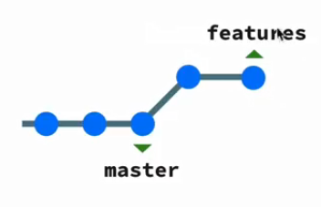
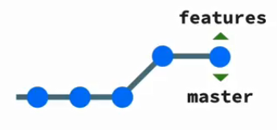
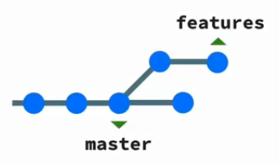
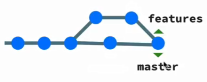
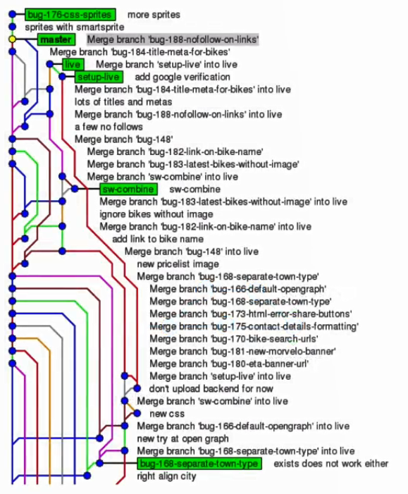
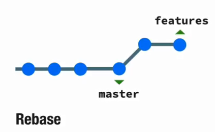

# Merge VS Rebase

* Dalam menggunakan git, kita bisa membuat branch yang nantinya akan kita merge kedalam branch utama. Branch ini bisa kita namakan `feature` misalnya. Ketika kita bekerja sendiri, ketika kita mengerjakan branch ini maka dapat dipastikan branch utama tidak akan mengalami perubahan.  

  

* Sehingga ketika kita melakukan merge feature tersebut ke dalam branch utama, merge yang kita lakukan akan bernama [Fast Forward Merge](./git-basic-command.md). Dan hasil merge ini akan seperti dibawah ini.  

  

* Tetapi ketika kita menggunakan git dengan tim yang terdiri dari orang lebih dari satu, maka akan ada momen ketika kita mengerjakan suatu branch milik kita sendiri, ternyata branch utama mengalami perubahan yang dilakukan oleh orang lain. Seperti gambar dibawah ini.  

  

* Karena adanya perbedaan start posisi commit maka tidak bisa dilakukan [Fast Forward Merge](./git-basic-command.md), dan yang terjadi jika dilakukan merge adalah [Three Way Merge/Merge Commit](./git-basic-command.md) seperti dibawah ini.  

  

* Pada team yang besar maka akan terjadi banyak sekali [Three Way Merge/Merge Commit](./git-basic-command.md) ini sehingga graph dari git nya akan menjadi seperti dibawah ini.  

  

* Hal ini membuat terjadinya kesulitan dalam melakukan track dari commit dan merge. Dan idealnya adalah semua merge dan commit adalah bertipe [Fast Forward Merge](./git-basic-command.md).

* Maka dari itu diperkenalkan lah yang dinamakan dengan namanya `Rebase`. Yang dilakuakn dari Rebase adalah ketika kita memilih kasus seperti dibawah ini.

  

* Rebase akan mendorong awal branch menjadi commit paling terbaru. Sehingga mergenya akan kembali menjadi [Fast Forward Merge](./git-basic-command.md). 

  

* Untuk melakukan `Rebase` kita hanya perlu menggunakan command `git rebase (branch tujuan)`.

* Git Rebase ini dilakukan pada branch yang ketinggalan secara bergantian. Dan akhirnya kita lakukan push kedalam remote repo. 

