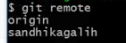
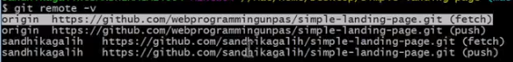
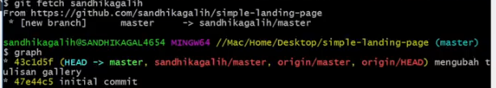

# Git Remote Command

## 1.  Git Clone

Digunakan untuk melakukan clone terhadap remote repository. Clone ini bisa ditambahkan alamat https seperti dibawah ini.

Syntax: `git clone https://github.com/yudisputra/my-goals.git`  

## 2. Git Remote

Digunakan untuk melakukan penambahan maupun pengecekan terhadap repo remote yang berhubungan dengan local repo yang digunakan. Penghubungan repo remote ini bertujuan agar kita dapat melakukan pengecekan dan pengambilan file terhadap repo tersebut jika ada perubahan.

### A. Pengecekan remote remote yang terhubung
Syntax dibawah digunakan untuk melihat semua remote yang terhubung.

Syntax: `git remote`

  

Syntax: `git remote -v`

  

### B. Penambahan remote baru
Kita bisa melakukan penambahan remote baru menggunakan syntax dibawah. Hal ini lebih sering digunakan pada repo yang menggunakan fitur fork.

Syntax: `git remote add (link repo remote)`

  
### C. Melakukan push local folder ke remote repo

1. Melakukan git init pada folder local.
2. Buat remote repo pada `github/gitlab`
3. Lakukan perintah untuk menghubungkan repo local dan remote `git remote add origin (link repo)`
4. Lakukan perintah push dengan `git push -u origin master`  

## 3. Git Push

Digunakan untuk melakukan push dari repo local ke repo remote yang tersambung

Syntax: `git push`

* Untuk melakukan penghapusan branch remote kita bisa melakukan penggunakan perintah push.

Syntax: `git push origin --delete (nama branch)`  

## 4. Git Fetch

Digunakan untuk melakukan pengecekan pada repo remote kondisi commit saat ini.

Syntax: `git fetch`

* Penggunaan lebih lanjut pada kasus dimana terdapat dua remote yang berbeda maka kita bisa mengspesifik untuk mengambil fetch dari remote tertentu

Syntax: `git fetch (nama remote)`  

  

## 5. Git Pull

Digunakan untuk melakukan pengambil file dari repo remote.

Syntax: `git pull`  

### [Back To Notes Index](./README.md)
