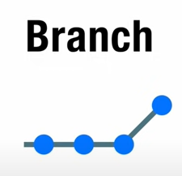
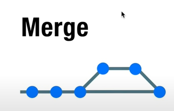

# Git Terminology

## 1. Branch

Membuat cabang baru dari commit commit yang telah kita lakukan. Digunakan untuk membuat fitur baru dari aplikasi yang dikerjakan.  

## 2. Merge
Menggabungkan branch yang ada ke jalur commit utama.  

## 3. Head
Menrujuk kepada branch yang sedang aktif saat ini.

