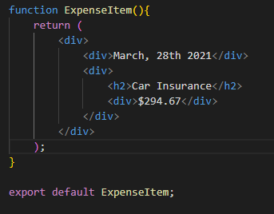
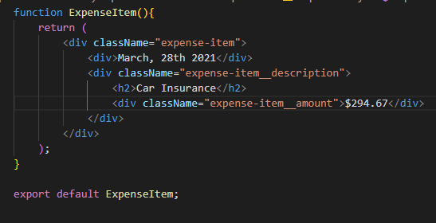

# React Step By Step

## 1. Buat Struktur HTML Terlebih dahulu

Buat susunan HTML terlebih dahulu bisa hanya sebagai kerangka awal saja



## 2. Beri Class Pada HTML

Beri Class pada element-elemen HTML dibawah adalah salah satu contoh pemberian class dimana div paling atas diberi nama sesuai dengan nama componentnya. Kemudian class yang lain diberi nama dengan tambah __ kemudian nama komponennya (expense-item__description)



## 3. Beri Style pada Component

Kita beri style dengan membuat suatu file css dengan nama yang sama dengan component yang kita buat.

```css
.expense-item {
  /* contoh style untuk div */
  /* gunakan flex untuk pengaturan item-item didalam content*/
  display: flex;
  justify-content: space-between;
  align-items: center;

  /* padding dan margin gunakan rem */
  padding: 0.5rem;
  margin: 1rem 0;

  /* box shadow untuk effect shadow pada div */
  box-shadow: 0 2px 8px rgba(0, 0, 0, 0.25);

  /* border radius dan bg color untuk pemanis*/
  border-radius: 12px;
  background-color: #4b4b4b;
}

.expense-item__description {
  /* seperti biasa karena dia adalah suatu container kita beri display flex*/
  display: flex;
  flex-direction: column;

  /* gap diberikan agar ada space antar display flex*/
  gap: 1rem;

  align-items: flex-end;
  flex-flow: column-reverse;
  justify-content: flex-start;

   /* flex is the shorthand for flex-grow, flex-shrink and flex-basis.  dan kita gunakan 1 biasanya*/
  flex: 1;
}

.expense-item h2 {
  /* untuk label seperti ini kita gunakan color font-size untuk melakukan styling*/
  color: #3a3a3a;
  font-size: 1rem;
  margin: 0 1rem;
  color: white;

  /* Kita beri flex 1 yaitu dimana komponen lain yang selain diberi flex 1 ini akan memakai width secukupnya, sedangkan yang diberi flex: 1 akan mengambil space yang tersisa */
  /* https://stackoverflow.com/questions/37386244/what-does-flex-1-mean#:~:text=If%20an%20element%20has%20flex,full%20space%20given%20to%20it. */
  flex: 1;
}

.expense-item__price {
  /* untuk div yang hanya mempunyai satu content seperti label dibawah ini kita bisa menggabungkan styling label dan containernya */
  font-size: 1rem;
  font-weight: bold;
  color: white;
  background-color: #40005d;
  border: 1px solid white;
  padding: 0.5rem;
  border-radius: 12px;
}

/* dibawah ini adalah styling yang digunakan ketika width nya lebih besar */
@media (min-width: 580px) {
  .expense-item__description {
    flex-direction: row;
    align-items: center;
    justify-content: flex-start;
    flex: 1;
  }

  .expense-item__description h2 {
    font-size: 1.25rem;
  }

  .expense-item__price {
    font-size: 1.25rem;
    padding: 0.5rem 1.5rem;
  }
}
```

 Dan jangan lupa untuk melakukan import pada komponent kita nantinya.
```js
import './ExpenseItem.css';
```

Jangan lupa untuk membuat tampilan dengan resolusi kecil terlebih dulu (agar tampilan pada layar lebih besar menjadi tidak rusak) dengan menggunakan @media

## 4. Ubah data hardcode menjadi variabel js

Kita ubah data hardcode data pada HTML menjadi variabel const sementara

```js
import './ExpenseItem.css';

function ExpenseItem(){
    const expenseDate = new Date(2023, 1, 12);
    const expenseTitle = 'Car Insurance';
    const expensePrice = 294.67;

    return (
        <div className="expense-item">
            <div>{expenseDate.toISOString()}</div>
            <div className="expense-item__description">
                <h2>{expenseTitle}</h2>
                <div className="expense-item__price">${expensePrice}</div>
            </div>
        </div>
    );
}

export default ExpenseItem;
```

## 5. Gunakan Konsep Props agar komponen menjadi reusable

Komponen yang kita gunakan sebelumny masih bersifat tidak reusable karena datanya berupa hard code. Untuk memberikan data dari luar/parent kita gunakan konsep props seperti dibawah ini.

```js
// Parent
  <ExpenseItem 
    title={expenses[0].title}
    amount={expenses[0].amount}
    date={expenses[0].date}
  />

// Dalam Component
  function ExpenseItem(props){
    return (
        <div className="expense-item">
            <div>{props.date.toISOString()}</div>
            <div className="expense-item__description">
                <h2>{props.title}</h2>
                <div className="expense-item__price">${props.amount}</div>
            </div>
        </div>
    );
  }
```