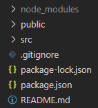
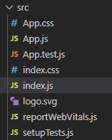
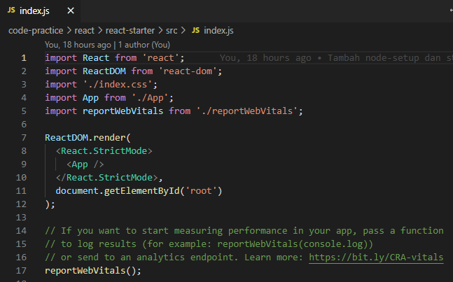
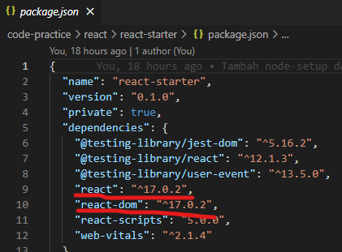
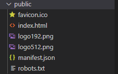
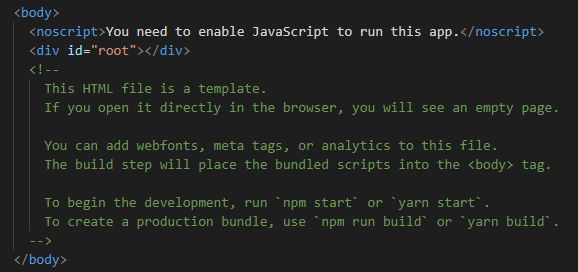
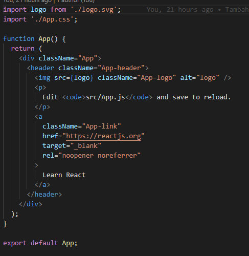

# Standard Project React

## 1. Command Pada React

Ketika sudah melakukan instalasi node js, kita bisa memulai melakukan instalasi app-react. Salah satu library yang paling sering digunakan untuk memulai project react adalah [Create React App](https://create-react-app.dev/)

Library ini menyediakan environment dasar untuk aplikasi berbasis react.

### a. Command Instalasi

Untuk melakukan instalasi kita hanya perlu membuka console pada folder yang kita inginkan, kemudian kita menuliskan suatu command.

```
npx create-react-app nama-aplikasi
```

### b. Command Start React
Tunggu beberapa saat maka aplikasi react sudah siap untuk dijalankan. Comman untuk menjalankan aplikasi react tersebut.

```
npm start
```
<br />

## 2. Structure Project React
<br />



Ketika project React sudah dibuat maka structure nya akan seperti diatas.

### a. SRC folder

Pada folder `src` ini adalah dimana kita akan sering bekerja.



#### i. Index.js

`Index JS adalah file yang akan di load pertama ketika aplikasi react dijalankan`. 

Bisa kita lihat dari file index.js ini code yang kita tuliskan sebenarnya lebih mirip ke code HTML yang kita tuliskan kedalam file javascript. Tetapi react melakukan transformasi tersebut dibelakang.



Jadi apa yang sebenarnya terjadi di index js ini, kita mulai dari dua line paling atas yaitu import `React` dan `ReactDOM`. Secara garis besar perintah import berfungsi untuk memanggil library yang sudah terinstal di project React kita. Ketika kita membuka file `package.json` kita bisa melihat bahwa kita menyertakan dua library tersebut untuk diinstall ketika kita melakukan set up project react kita.



Sehingga bisa diartikan kita memanggil dua library tersebut kedalam index js. Kemudian pada baris 7 sampai 12 kita bisa melihat bahwa kita memanggil fungsi `ReactDOM.render` dan kemudian menerima dua parameter yaitu `<App />` dan `document.getElementById('root')`.

Kita akan membahas `document.getElementById('root')` terlebih dahulu, seperti yang kita tahu bahwa syntax javascript ini digunakan untuk mencari sebuah element HTML dengan `Id` yaitu `root`. Tetapi dimanakan sebenarnya file HTML yang dimaksud ?

Kita akan membuka folder `public` terlebih dahulu, didalam folder `public` ini kita bisa melihat structure seperti dibawah ini.



Kemudian kita akan menemukan satu-satunya file html pada proyek React yang kita buat yaitu `index.html`. Didalam file ini kita akan menemukan div dengan id `root`.



Kemudian apa yang dimaksud dengan `<App />`, App disini adalah yang kita sebut dengan `Components` dan kita tahu bahwa components adalah hal yang penting pada react. Kita bisa melihat bahwa App diimport dari file `App` yang berada pada file index.js. Dan ketika kita buka file `App` maka kita akan bisa melihat hasil filenya seperti pada dibawah.



Bisa kita lihat dari file tersebut bahwa code tersebut mungkin sedikit aneh, dikarenakan terdapat tag HTML didalam function javascript. Tetapi component tersebut tetap masih bisa berjalan. Hal ini dikarenakan adanya fitur dari React yang bernama `JSX`.

Jadi kesimpulan dari syntax

```jsx
ReactDOM.render(<App />, document.getElementById('root'));
```

adalah isilah `Element dengan Id root dengan component bernama App`.

### [Back To React Index](../../README.md)


