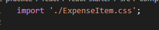

# Basic Styling Pada Custom Component

## 1. Pemberian Nama Class pada tag HTML

Seperti proses pemberian style pada html seperti umumnya kita harus memberikan nama class. Tetapi syntax pemberian class sedikit berbeda dengan html pada umumnya yaitu tidak menggunakan `classname` tetapi `className`. Hal ini terjadi dikarenakan tag html pada react tidak sepenuhnya adalah html biasa tetapi adalah sebuah jsx.

## 2. Import CSS kedalam custom component

Jika kita sudah memiliki file CSS, kita tinggal melakukan import kedalam custom component yang kita memiliki. Untuk melakukan import css sedikit berbeda dengan melakukan import custom components.

### [Back To React Index](../../README.md)
