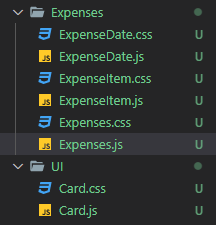

# Custom Component

Kita sudah mengenal bahwa konsep berputar pada React. Jadi bagaimana cara agar kita membuat custom component milik kita sendiri ?

Yang pertama kita membuat folder baru pada folder src yaitu bernama `components` pada folder ini kita akan meletakkan semua custom components milik kita.

Semakin banyaknya custom component yang kita buat maka dari itu didalam folder `components` kita bisa membuat beberapa subfolder sesuai dengan konteks dari komponen-komponen yang berada didalamnya.

### [Back To React Index](../../README.md)