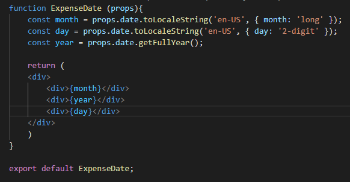
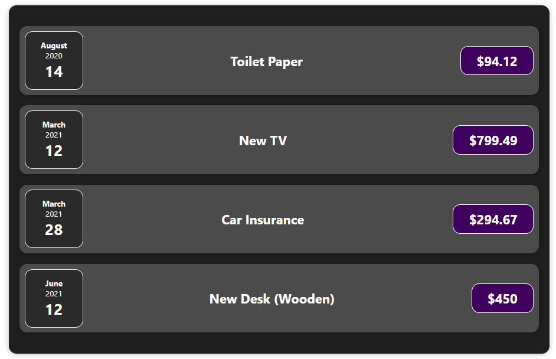
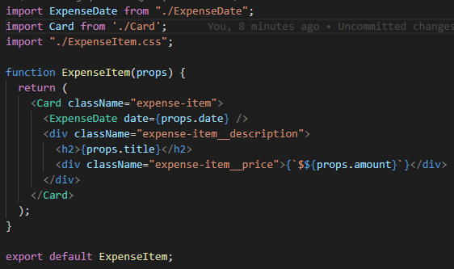
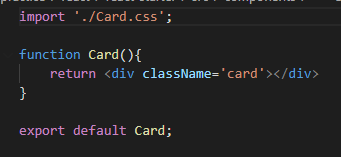
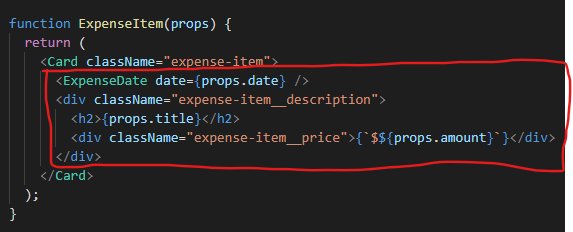
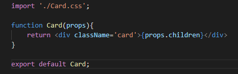
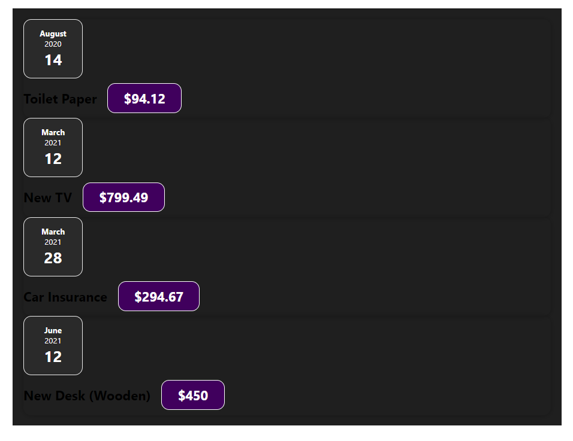
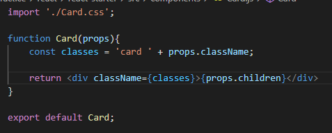

# Konsep Composition ( Children Props )

Seperti yang sudah kita ketahui bahwa kita selalu menggunakan components dalam membangun aplikasi React. Kita membuat suatu komponen yang dapat kita isi dengan komponen lainnya, Umumnya pendekatan membangun User Interface dari block bangunan yang lebih kecil ini disebut `Composition`.

Kemudian bagaimana jika kita ingin membuat komponen yang sebenarnya hanya berfungsi sebagai `shell ( wadah )` dari kontent yang akan diisi kedalamnya. Selama ini kita selalu membuat sebuah komponen yang spesifik fungsinya. Contohnya adalah seperti dibawah ini:

Component ExpenseDate diatas memiliki fungsi yang secara spesifik melakukan handle tanggal pengeluaran. Dan kita memberikan props sebagai datanya. Komponen seperti ini sangat standar didalam aplikasi React. Tetapi bagaimana ketika ingin membuat suatu komponen yang fungsinya hanya sebagai wadah dari komponen lain ?

Contoh dari component seperti tersebut adalah seperti dibawah ini :

Wadah yang paling luar dari layout diatas berbentuk persegi dengan border sudut yang berbentuk sedikit bulat adalah yang biasa kita sebut sebagai `Card`. `Card` tersebut berfungsi sebagai wadah dari komponen lainnya. Keuntungan dari penggunaan komponen yang berfungsi sebagai wadah seperti ini adalah kita dapat menggunakan komponen yang sama dan reusable dengan style yang sama juga ataupun logic yang sama.

Hal yang kita inginkan adalah seperti dibawah ini:

Dan komponen Card yang kita buat adalah seperti dibawah ini:

Tetapi hasil yang didapat adalah seperti dibawah ini:

Hal diatas dikarenakan untuk melakukan render data yang berada pada setelah open tag dan closing tag dari komponen card, kita tidak bisa menggunakan props seperti pada biasanya.

Ada satu props khusus yang sudah dipesan oleh react yang digunakan untuk melakukan render terhadap konten apapun yang berada ditengah-tengan open dan close tag dari custom komponent yang kita buat. Nama dari key props tersebut adalah `children`.

Props Children ini kita tidak perlu deklarasikan setiap custom komponen yang kita buat akan selalu memiliki props children ini.

Selain itu ada satu hal lagi yang perlu diingat ketika kita membuat `shell ( wadah )` untuk komponen lain yaitu props `className`. Bisa kita lihat seperti dibawah ini ketika kita mengganti `div` menjadi `Card` maka hasil dari layout terlihat berantakan.

Custom komponen yang kita buat hanya akan selalu melakukan pass data sesuai props yang kita berikan sehingga kita perlu menambahkan props yang sesuai dengan yang kita inginkan.

### [Back To React Index](../../README.md)

