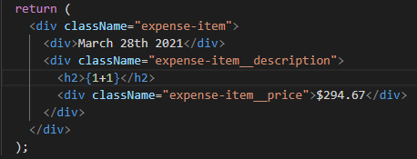

# Dynamic Data Custom Components

Pada penggunaan custom components nantinya pastinya kita tidak mungkin menggunakan data yang di `hard code`. Maka dari itu pastinya kita akan menggunakan data dinamis. Untuk menggunakan data dinamis tersebut kita bisa menggunakan syntax `{}` diantara tag HTML. Syntax tersebut bersifat spesial dikarenakan kita bisa menuliskan logic javascript apapu didalamnya. Contoh :

Contoh custom component yang menggunakan stored variable pada const local

### [Back To React Index](../../README.md)
