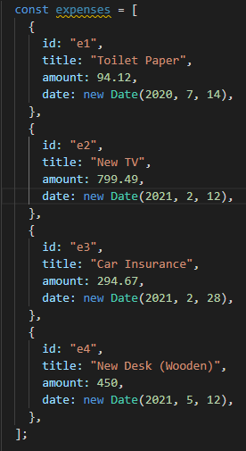

# Passing Data Menggunakan "Props"

Kita sudah bisa menggunakan custom component kita berkali-kali (reusable) dan juga kita sudah bisa memberikan data dinamis untuk custom component kita. Tetapi masalahnya data dinamis yang kita berikan bersifat local berada pada custom component tersebut. Bagaimana kah agar kita bisa memberikan data dari luar custom component tersebut.

Maka dari itu diperkenalkan sebuah fitur yang bernama `Props (Properties)`. Props ini memungkinkan kita dapat melakukan passing data dari suatu component ke component lainnya. Props ini penulisannya sama seperti `attributes` pada tag html umumnya. Dikarenakan dalam react kita sebenarnya membuat custom element HTML kita sendiri.

Sama seperti function biasa pada javascript kita bisa memberikan parameter. Sesuai konvensi pada react function component parameter dari fungsi ini mempunyai nama `props`. Contoh penggunaan dari props adalah :

Dari sebelum stored data local pada component:

Menjadi menggunakan props:

Pada App JS kita bisa passing data seperti dibawah ini:

Bisa kita lihat diatas bahwa Custom component dapat kita beri props atau pada tag html biasa kita biasa sebut atribut. Yang perlu kita perhatikan disini adalah nama key dari object props pada custom component `ExpenseItem` harus sama dengan atribut yang di passing.

Sebagai tambahan props yang kita lempar tidak secara langsung kita harus menempelkan pada html yang kita butuhkan, tetapi kita juga mengolahnya terlebih dahulu. Contohnya adalah seperti dibawah ini:

### [Back To React Index](../../README.md)
