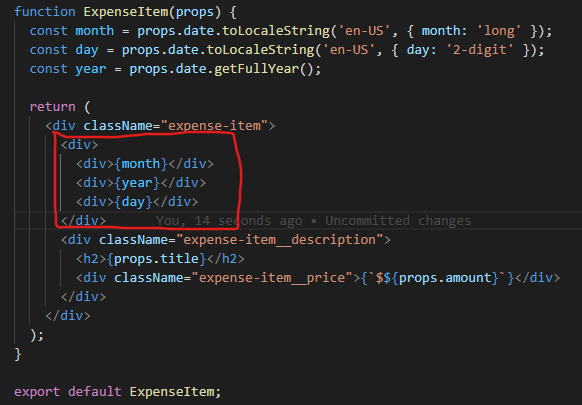
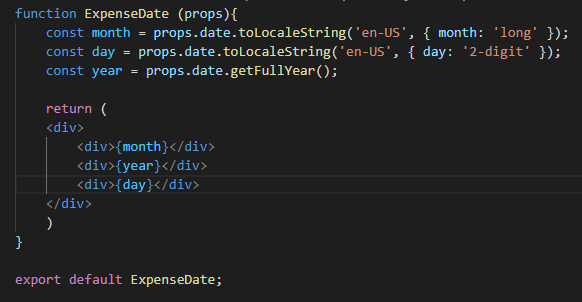

# Memisahkan Component menjadi Multiple Components

Semakin besar suatu custom component yang dibuat maka akan semakin besar component tersebut dapat dipecah menjadi multiple components. Contohnya adalah seperti dibawah ini:

Dapat dilihat diatas bahwa untuk menampilkan month, day dan year memiliki logicnya sendiri. Sehingga hal ini membuat kita dapat memisahkan bagian dari layout tersebut menjadi komponen sendiri.

Yang perlu diperhatikan dalam hal ini kita melakukan passing props berkali-kali kedalam component yang berada didalam component lainnya seperti dibawah ini:

a. Dari App

b. Turun ke ExpenseItem

c. Terakhir pada Expense Date

Hal ini lumrah dilakukan pada react karena menyusung konsep component.

### [Back To React Index](../../README.md)

