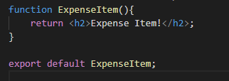
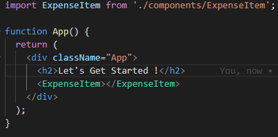

# Langkah Pembuatan Custom Components

## 1. Penulisan Code Pada Custom Components

Penulisan code custom pada component sebenarnya sederhana yaitu sebuah function biasa yang memiliki return tag html.

## 2. Lakukan Export Component agar dapat dipakai di file lainnya.

Setelah penulisan code selesai jangan lupa lakukan export agar file tersebut dipanggil di file lainnya.

## 3. Lakukan Import Component pada file yang diinginkan.

Untuk melakukan import custom component kita bisa menggunakan syntax import nama custom component.

### [Back To React Index](../../README.md)
