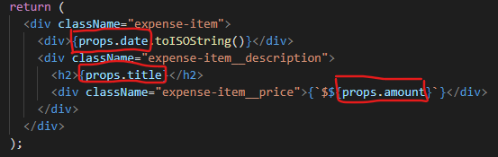
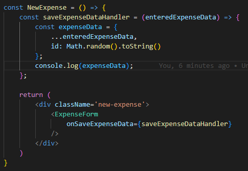
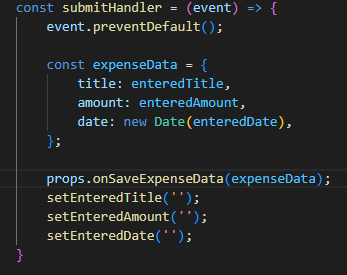
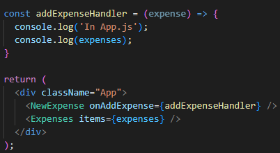
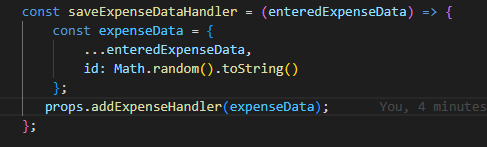

# Child To Parent Component Communication

Kita sudah mempelajari cara komunikasi antara sebuah parent component dengan child component didalamnya, yaitu menggunakan sebuah konsep React yang bernama `props`.

Kemudian bagaimana dengan sebaliknya ?, bagaimana cara komunikasi antara child component terhadap component parentnya ?

Hal ini dapat dilakukan dengan melakukan passing props juga tetapi berbentuk sebuah `function`. Contohnya adalah dibawah ini:

Komponent `NewExpense` sebagai parent ingin mengambil data dari `ExpenseForm` yaitu childnya. Di `NewExpense` kita membuat sebuah function bernama `saveExpenseDataHandler` dimana bisa kita lihat dia menerima sebuah parameter. Parameter ini nantinya akan diisi dengan data yang ingin kita ambil dari child component. Setelah kita selesai membuat function tersebut, kita bisa langsung lempar sebagai props terhadap child componentnya.

Pada child component kita tinggal memanggil function props dari parent tersebut dimana kita inginkan.

Kita bisa melakukan hal ini secara berulang tergantung dalamnya hubungan antara parent dan child yang ingin dituju.

### [Back To React Index](../../README.md)

