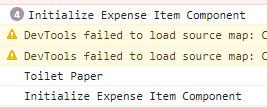

# Lebih Dalam Tentang State

## 1. Bagaimana sifat useState dalam suatu Component ?

Kita sudah bisa menggunakan konsep useState dalam komponent yang telah kita buat, tetapi bagaimanakah sifat useState yang telah kita gunakan jika komponen yang kita buat dipanggil berkali-kali dalam sebuah komponen seperti dibawah ini.

State yang dibuat bersifat spesifik untuk `instance` komponen yang dituju. Yang artinya walaupun kita memanggil komponen dengan state tersebut 4 kali, maka state yang berada didalamnya akan didaftarkan secara terpisah sesuai dengan `instance`nya. 

Hal ini sangat wajar karena kalau tidak, jika kita mengubah satu state dari komponen yang sama. Maka state komponen yang lain akan ikut berubah.

Untuk membuktikannya kita akan menggunakan console.log:

Bisa dilihat Console Log Initialize muncul 4 kali dikarenakan Expense Item Component dirender 4 kali sesuai dengan jumlah Expense Item Component yang dipakai. Kemudian ketika salah satu button di klik hanya satu Initialize yang terpanggil, hal ini dikarenakan state yang berubah hanya salah satu dari 4 komponen yang ada. Sehingga render menggunakan useState hanya terjadi pada komponen tersebut.

## 2. Mengapa UseState menggunakan const ?

Alasan mengapa kita menggunakan const ketika memakai useState adalah untuk melakukan assign value baru terhadap nilai useState yang kita deklarasikan, kita menggunakan function yang telah disediakan useState yaitu `set...` dan bukan menggunakan `title = 'Updated`.

## 3. Jika useState yang kita gunakan mendapat nilai awal, Apakah setiap komponent di Render, maka kita akan mengoverwrite state nya menjadi nilai awal tersebut lagi ?

useState bisa diberikan nilai awal seperti diatas yaitu `props.title`. Kemudian jika terjadi perubahan data pada state maka komponen akan di render, sehingga timbul pertanyaan bukannya useState tersebut akan memakai nilai awal yaitu `props.title` itu lagi ?

Jawabannya adalah `Tidak`. UseState melakukan track terhadap nilai state yang ada sehingga nilai awal tersebut akan dipakai hanya benar-benar sekali yaitu ketika komponent tersebut `di initialize pertama kali`.

### [Back To React Index](../../README.md)
