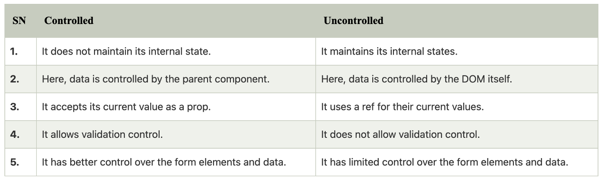

# Uncontrolled VS Controlled Component & Stateless VS Stateful Components

## A. Uncontrolled Components VS Controlled Components

`Controlled Component` adalah suatu komponen yang menerima valuenya melalui props dan jika ada perubahan maka perubahannya akan dikirim melalui sebuah callback seperti `onChange`.

```js
// Controlled:
<input type="text" value={value} onChange={handleChange} />
```

`Uncontrolled Component` adalah komponen yang menyimpan state nya sendiri secara internal dan kita mengambil valuenya menggunakan `ref` ketika kita butuhkan. Uncontrolled Component lebih seperti traditional HTML.

```js
// Uncontrolled:
<input type="text" defaultValue="foo" ref={inputRef} />
// Use `inputRef.current.value` to read the current value of <input>
```




## B. Stateless VS Stateful Components

### * Dumb / Stateless / Presentational Component
🦄 Dumb components focus on how things look.

Dumb components are also called ‘presentational’ components because their only responsibility is to present something to the DOM. Once that is done, the component is done with it.
There will be no logic at all inside this component therefore it is called a dumb component. Because dumb components only focus on the presentation (UI Component), it is ideally the most reusable component.
This component is often just Javascript functions and only has a render() method. It also does not have any state or lifecycle hooks. However, it still can receive some data and function from the parents via props.
Common characteristics of dumb components:

Focus on the UI: Almost all basic UI components should be considered dumb components. Examples include loaders, modals, buttons, inputs, etc.
Accept props: Dumb components accept props to allow them to be dynamic and reusable. For example, you might send the title of a button in props from the parent component to allow it to have a unique name.
Require no app dependencies: Other than UI packages, like Reactstrap, dumb components do not require dependencies.
Rarely include state: The only instance where a dumb component has state is for manipulating the UI itself, not application data. Some examples of where a dumb component might have state would be button groups, tabs, switches and other UI elements that do not impact the data, only the UI.

### * Smart / Stateful / Container Component
🤓 Smart components focus on how things work.

Smart components (or container components) on the other hand have a different responsibility. Because they have the burden of being smart, they are the ones that keep track of the state and care about how the app works. Using the container design pattern, the container components are separated from the presentational components and each handles their own side of things. The container components do the heavy lifting and pass the data down to the presentational components as props.
Container component pattern is class-based components and have constructor() functions. We usually initialize the state inside the constructor, although you can remove the constructor and still have a state.
Common characteristics of smart components include:

Manipulates Data: Smart components can fetch, capture changes and pass down application data.
Call Redux, Lifecycle methods, APIs, Libraries, etc: These components are called smart for a reason! They are responsible for calling libraries and functionality.
Manage state: Smart components are responsible for managing state and knowing when to re-render a component.
Rarely includes styling: Since dumb components focus on styling, it allows the smart component to focus on functionality without the clutter of styles too.

### [Back To React Index](../../README.md)


