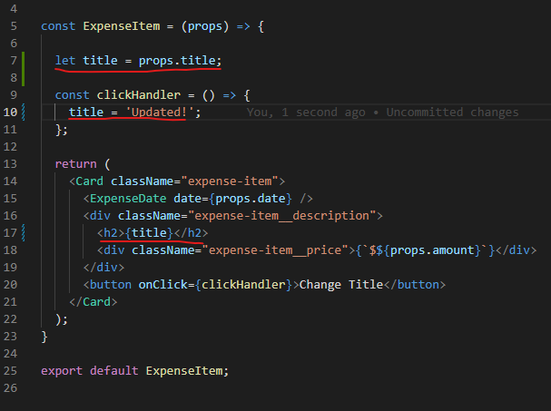
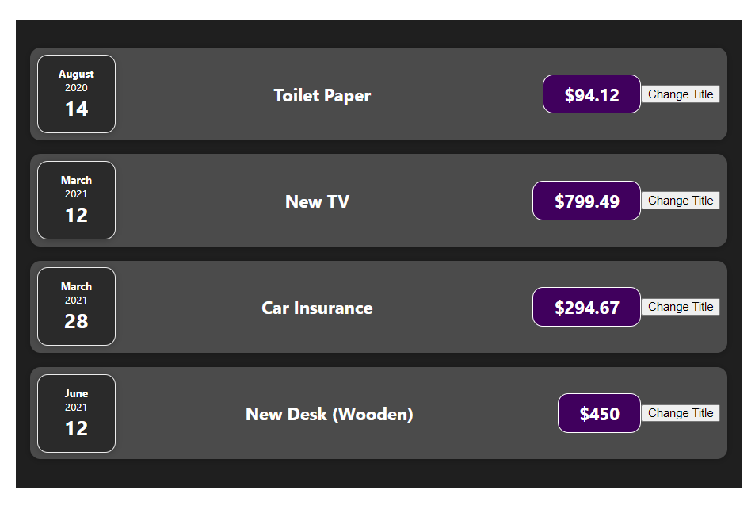
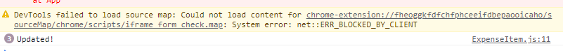
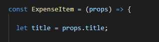
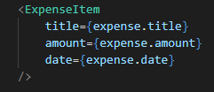

# Bagaimana Functions dalam Components di Eksekusi ?

Kita sudah belajar bagaimana cara untuk mengtrigger sebuah event didalam component, maka dari itu kita akan mencoba untuk melakukan perubahan data pada component yang kita punya. Kita akan mencoba mengubah title dalam component kita.

Contoh diatas kita bisa melihat bahwa kita membuat sebuah variable title yang awalnya menerima props dengan key title. Kemudian pada clickhandler kita ubah title tersebut menjadi `updated!` dan yang terakhir kita gunakan variable title pada return html component kita.

Kode ini kelihatan benar tetapi hasil dari kode ini tidak mengubah title sesuai yang kita inginkan. Pada halaman yang kita buat title nya tetap tidak berubah.

Tetapi dapat dipastikan bahwa event click handler berjalan seperti semestinya dan bahkan title kita telah berubah, untuk membuktikannya kita dapat memberikan sebuah console log pada function click handler kita.

Jadi kenapa hal ini terjadi ?. Mengapa perubahan data ini tidak mengubah DOM kita ?

Jawabannya adalah : `React tidak bekerja seperti itu`.

Jadi penjelasannya adalah seperti yang kita tahu bahwa `components` adalah sebenarnya hanya `function` yang mengembalikan jsx code. Tetapi karena `components` adalah function maka ada sesuatu yang harus memanggil function ini.

Bisa kita lihat bahwa untuk memanggil sebuah `components` kita menuliskan components ini seperti HTML. Sebenarnya yang terjadi di belakang adalah hal ini sama saja dengan kita memanggil sebuah function.

Ketika component ini dipanggil React akan membaca semua code yang ada mulai dari logic hingga sampai jsx code yang ada kemudian akan dilanjut dengan penggambaran pada screen kita. Yang jadi poin utama adalah `setelah membaca semuanya maka React tidak akan membacanya lagi`.

Tetapi sayangnya di application modern kita selalu ingin melakukan update apa yang ditampilkan pada layar. Jadi kita perlu memberi tahu React bahwa ada `perubahan` maka dari itu React memperkenalkan concept yang dikenal dengan `State`.

### [Back To React Index](../../README.md)

