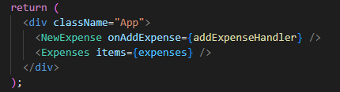

# Lifting The State Up

Kita sudah mengenal konsep komunikasi antara child terhadap parentnya dan sebaliknya yaitu parent terhadap childnya. Ada yang perlu diperhatikan dalam melakukan komunikasi antar komponen yaitu `dimana kita harus menaruh state`.

Untuk lebih jelasnya adalah seperti contoh dibawah ini:



Pada contoh diatas komponent `Expenses` menggunakan `expenses` sebagai nilai props items untuk menampilkan data. Sedangkan untuk menambah nilai `expenses` kita menggunakan komponen yang bernama `NewExpense`. Disini perlu diperhatikan bahwa kita harus mencari dimana titik state tersebut digunakan pada dua komponen tersebut. Dalam hal ini yaitu pada komponen `App`.

```
Intinya adalah kita harus mencari titik temu dimana sebuah state dapat mengcover semua child komponen yang kita butuhkan. Tidak perlu harus di `App.js` dimana adalah kulit paling luar. Kita hanya perlu menaikkan state tersebut secukupnya saja.
```

### [Back To React Index](../../README.md)

