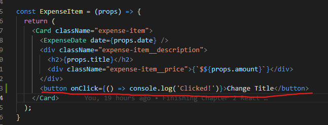
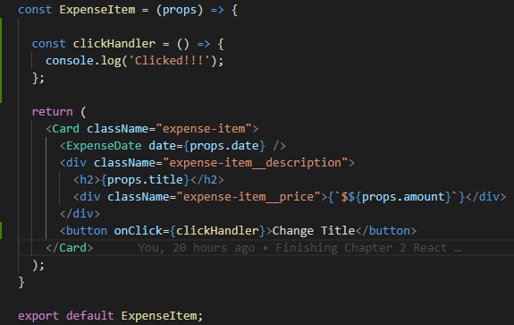
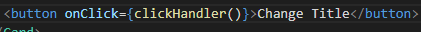
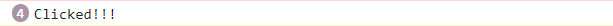

# Listening To Events & Working With Event Handlers

Langkah pertama agar aplikasi React kita dapat menjadi interaktif adalah dengan mengenal konsep events. Pada elemen HTML secara default memiliki banyak events yang dapat kita trigger atau kita listen. Dibawah ini adalah list event yang ada:

[Event List](https://developer.mozilla.org/en-US/docs/Web/API/GlobalEventHandlers)

Didalam React semua event ini juga dapat kita trigger. Sebagai contoh kita akan menggunakan event yang paling umum di listen yaitu `onClick`. Penamaan semua event dimulai dengan kata `on` dan diikuti dengan huruf kapital aksinya seperti `Click`.

Kita bisa memberikan perintah simpel seperti `console.log` untuk melakukan uji listening events. Tetapi ketika listening events nya memiliki fungsi yang complex seperti ada logic dibelakangnya. Kita perlu membuat sebuah function khusus yang biasa kita sebut `Event Handlers`. 

Sesuai `Konvensi` penamaan `Event Handlers` yaitu `nama aksi ( seperti click )` + `handler` sehingga menjadi `clickHandler`. Kemudian pada attribut onClick pada HTMl kita tinggal memanggil nama Event Handler yang telah kita buat. Gambar diatas adalah contoh yang benar kita hanya menuliskan namanya saja tanpa memberikan kurung kurawal setelah nama event handlers nya. Yang perlu diperhatikan adalah ketika kita memberikan nama event handler dengan memberikan kurung kurawal seperti dibawah ini:

Maka ketika elemen tersebut dirender oleh React pertama kali Event tersebut akan langsung dijalankan tanpa perlu diklik terlebih dahulu sekalipun. Hal ini yang perlu diingat ketika kita memanggil Event Handlers.

### [Back To React Index](../../README.md)

