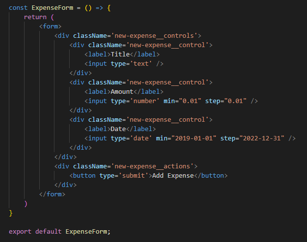

# Bekerja Dengan Form Input

Pada chapter ini kita akan membahas tentang bagaimana menambah form pada aplikasi React yang kita buat.

## 1. Menambahkan Field Yang Dibutuhkan

Langkah pertama yang kita lakukan adalah menambahkan field dan label pada form. Buatlah field menggunakan HTML component yang sudah tersedia dan sesuai sepert input type text jika hanya dibutuhkan string atau input type number untuk melimitasi input hanya menerima number.

## 2. Menambahkan Event Listener Kedalam Field yang Ada

Langkah selanjutnya kita akan menambahkan event listener kedalam setiap field yang ada.

Kita bisa tambahkan event listener seperti onChange pada field, jadi ketika ada perubahan nilai pada field tersebut kita bisa melakukan sebuah aksi.

Pada handler kita bisa menerima sebuah parameter default yaitu yang bernama `event` atau `e`. Yang berisi semua data dari DOM html dari field tersebut, termasuk yang paling sering dipakai yaitu mendapatkan nilainya yaitu `event.target.value`.

## 3. Menambahkan Multiple State Untuk Nilai Field Yang

Kemudian kita akan menambahkan beberapa state sejumlah dari field yang ada pada form.

State-state berikut ini disimpan nilainya menggunakan event handlers yang telah dibuat. State-state ini juga dibuat agar memudahkan ketika form yang kita gunakan akan digunakan untuk proses `update`.

### * Alternatif menggunakan Satu State

Selain menggunakan multiple state kita juga bisa menggunakan alternatif yaitu menggunakan hanya satu state berbentuk Object.

Ada yang perlu diperhatikan disini yaitu untuk melakukan set terhadapat statenya kita perlu menggunakan `Spread Operator` hal ini dilakukan agar nilai state yang lainnya tercopy dan kita hanya melakukan replace pada nilai object yang diinginkan.

