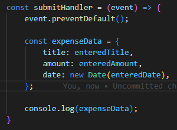

# Bekerja Dengan Form Input

Pada chapter ini kita akan membahas tentang bagaimana menambah form pada aplikasi React yang kita buat.

## 1. Menambahkan Field Yang Dibutuhkan

Langkah pertama yang kita lakukan adalah menambahkan field dan label pada form. Buatlah field menggunakan HTML component yang sudah tersedia dan sesuai sepert input type text jika hanya dibutuhkan string atau input type number untuk melimitasi input hanya menerima number.

## 2. Menambahkan Event Listener Kedalam Field yang Ada

Langkah selanjutnya kita akan menambahkan event listener kedalam setiap field yang ada.

Kita bisa tambahkan event listener seperti onChange pada field, jadi ketika ada perubahan nilai pada field tersebut kita bisa melakukan sebuah aksi.

Pada handler kita bisa menerima sebuah parameter default yaitu yang bernama `event` atau `e`. Yang berisi semua data dari DOM html dari field tersebut, termasuk yang paling sering dipakai yaitu mendapatkan nilainya yaitu `event.target.value`.

## 3. Menambahkan Multiple State Untuk Nilai Field Yang

Kemudian kita akan menambahkan beberapa state sejumlah dari field yang ada pada form.

State-state berikut ini disimpan nilainya menggunakan event handlers yang telah dibuat. State-state ini juga dibuat agar memudahkan ketika form yang kita gunakan akan digunakan untuk proses `update`.

### * Alternatif menggunakan Satu State

Selain menggunakan multiple state kita juga bisa menggunakan alternatif yaitu menggunakan hanya satu state berbentuk Object.

Ada yang perlu diperhatikan disini yaitu untuk melakukan set terhadapat statenya kita perlu menggunakan `Spread Operator` hal ini dilakukan agar nilai state yang lainnya tercopy dan kita hanya melakukan replace pada nilai object yang diinginkan.

Selain menggunakan spread operator ada satu cari lagi yang disarankan yaitu menggunakan `prevState`. Hal ini khusus dilakukan jika update state bergantung pada `state sebelumnya`.
Cara yang bisa dilakukan adalah seperti dibawah ini:

Jadi kenapa dilakukan hal seperti ini ?

Sebenarnya cara yang pertama maupun kedua pun sama saja, tetapi cari yang kedua lebih disarankan karena kita tahu ketika suatu state diupdate maka React akan melakukan schedule untuk proses updatenya. Dan ketika React melakukan hal itu bisa saja state yang kita bergantung adalah state yang salah atau yang tidak terupdate.

Jadi ketika kita menggunakan cara yang kedua React memastikan bahwa `prevState` yang digunakan adalah state yang paling terupdate.

## 4. Melakukan Handle Submit Button Form

Untuk melakukan handle submit form banyak programmer yang salah melakukannya dengan memberikan event `onClick` pada button submitnya seperti dibawah ini.

Hal yang `benar` untuk dilakukan adalah dengan memberikan event pada tag form nya yaitu `onSubmit`.

Kemudian function submitHandlernya kita buat seperti dibawah ini.

Yang perlu kita lihat disini kita melakukan pencegahan aksi default form yaitu melakukan pencegahan form melakukan pengiriman request dan melakukan reload halaman. Sehingga kita bisa memberikan aksi yang lebih spesifik yang kita inginkan.

## 5. Two Way Binding

Ada salah satu konsep penting dalam form pada React, yaitu adalah `Two Way Binding`. `Two Way Binding` adalah suatu cara dimana secara implicit kita memaksa sebuah DOM html memiliki nilai (value) yang selalu konsisten dengan sebuah `state`.

Untuk melakukan Two Way Binding ini kita lakukan dengan cara seperti dibawah ini:

Bisa dilihat diatas bahwa value diisi dengan sebuah state yang bernama `enteredTitle`. Hal ini membuat bahwa DOM tersebut berada dalam situasi infinite loops tetapi tenang saja hal ini tidak seperti itu.

Salah satu keuntungan menggunakan `Two Way Binding` ini adalah kita bisa melakukan reset pada input ketika form sudah disubmit. Hal ini dilakukan dengan cara melakukan `setValue` kosong. Sehingga DOM yang di `Two Way Binding` juga akan mengikuti nilai state nya.

### [Back To React Index](../../README.md)

