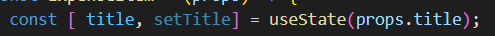
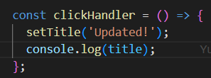

# Bekerja dengan State

Seperti pada pembahasan sebelumnya kita akan belajar mengenai `State`. Untuk mengimport state kita akan menambahkan sesuatu yang spesifik dari library `React` yang bernama yaitu `useState`.


Dalam library untuk melakukan import sesuatu yang spesifik kita perlu memberikan kurung kurawal pada komponen yang ingin kita panggil seperti pada gambar diatas.

## A. Pengerian useState

`useState` adalah sebuah function yang disediakan oleh library React untuk mendeklarasikan sebuah nilai sebagai sebuah `state` dimana perubahan dari nilai ini akan direfleksikan dimana component useState itu berada.

`useState` juga merupakan salah satu library react yang biasa disebut dengan `React Hooks`. `Hooks` pada dasarnya adalah function yang disediakan React untuk mempermudah kita dalam menggunakan state dan fitur React lain seperti lifecylce method, context dll.

Ada satu kesamaan dari semua `Hooks` yaitu adanya penggunaan kata `use` dari semua hooks. Kemudian hooks hanya bisa ditulis didalam function component secara langsung yang artinya tidak bisa diluar ataupun didalam nested function dalam component function. 

## B. Cara Memakai useState


Function useState menerima satu parameter yaitu nilai default awal dari statenya itu sendiri. useState sebenarnya memiliki nilai return yaitu sebuah array yang dimana pada indeks ke `0` adalah `nilai atau statenya`. dan index yang `1` adalah function yang dapat digunakan untuk melakukan assign terhadap `nilai useState tersebut`.

Kita dapat menggunakan array destructuring untuk mengambil kedua nilai array dari useState. Seperti dibawah ini:



Kemudian kita bisa menggunakan variable `title` pada elemen jsx kita.


Kemudian kita melakukan memberikan nilai baru pada variabel useState dengan menggunakan event handler yang sudah kita punya.


Kemudian mengapa menggunakan setTitle ini akan melakukan perubahan dom kita tetapi tidak dengan menggunakan cara yang sebelumnya ?

Jawabannya adalah karena variabel yang dibuat dengan `useState` bersifat spesial jadi ketika ada perubahan nilai pada useState yang ada maka React akan menjalankan kembali function component dia berada.

Ada satu poin yang perlu diperhatikan ketika kita memberikan kode console.log tepat setelah `set..` pada useState seperti dibawah ini.



`Console.log` tersebut akan menampilkan nilai lama dan bukan nilai baru dari `useState` title. Hal ini dikarenakan perubahan nilai state telah dischedule tetapi tidak terjadi secepat itu, sehingga console log masih mendapat value yang lama.

```
UseState merupakan salah satu concept utama untuk manajamen varibel yang berhubungan dengan rendering function component lagi.
```


### [Back To React Index](../../README.md)


