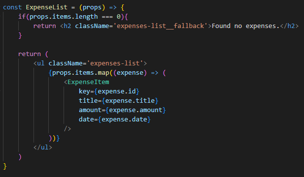

# Menambah Statements Conditional Return

Ketika kita membuat sebuah component kita biasanya membuat suatu return utama yang ditampilkan untuk dirender. Tetapi dengan kita sudah belajar tentang outputting conditional content kita bisa memberikan suatu Conditional Return seperti dibawah ini:

Bisa dilihat pada gambar diatas ketika `props.items` memiliki panjang data 0 maka sebuah `Conditional Return` dikembalikan yaitu pada case ini adalah sebuah `h2`.

Tetapi tetap dalam komponen tersebut memiliki sebuah return utama yaitu mengembalikan data yang ada.

### [Back To React Index](../../README.md)

