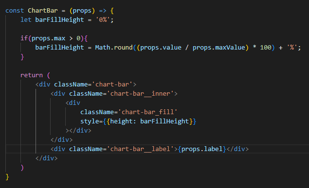

# Menambah Dynamic Styles

Kita bisa membuat sebuah nilai dari styles dengan dinamis pada React. Hal ini cukup simple dilakukan yaitu pada tag HTML yang ada selalu memiliki sepbuah `props` yang bernama `styles`. 

Bisa dilihat pada contoh diatas bahwa style pada div `chart-bar__fill`, style nya diisi dengan nilai `barFillHeight` yang bersifat dinamis. Yang perlu diperhatikan disini adalah untuk menggunakan `style` dibutuhkan dua kurung kurawal. Kemudian untuk naming properties CSS didalamnya tidak menggunakan `-` tetapi disambung dengan `CamelCase`.

### [Back To React Index](../../README.md)

