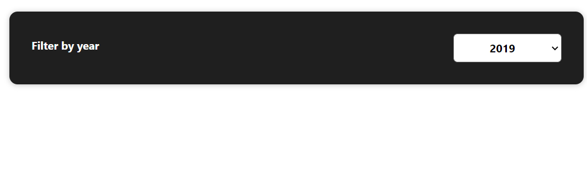
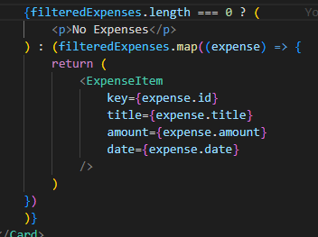
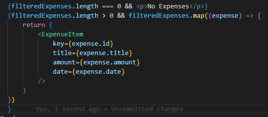
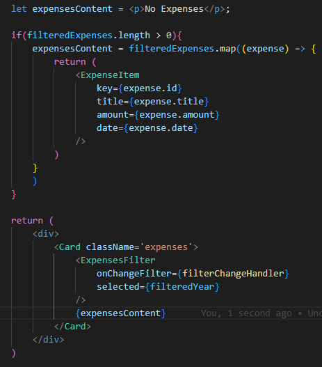

# Menampilkan Conditional Content

Conditional content adalah mengeluarkan output berbeda dari suatu content ketika ada kondisi berbeda. Salah satu contoh yang paling sering terjadi adalah ketika tidak ada data yang ditampilkan didalam kontent.

Seperti layout diatas akan lebih baik jika ditampilkan message `No Data Available`.

Untuk membuat tampilan seperti tersebut, kita bisa menuliskan `Conditional Content` dengan beberapa cara seperti dibawah ini:

## 1. Memakai Ternary If Else

Kita bisa menuliskan conditional content seperti diatas yaitu dengan melakukan pengecekan terhadap panjang data dari content yang dirender. Penulisan diatas menggunakan `Ternary Operator` yang memang sudah dari JS sendiri. Arti dari ternary operator diatas adalah jika `filteredExpenses` panjangnya 0 maka tampilkan `No Expenses` message dan jika tidak render kontennya.

Tetapi penulisan diatas agak sulit dibaca, ada cara lain dimana sering dilakukan developer yaitu seperti dibawah ini:

## 2. Memakai Logical AND (&&)

Cara yang kedua dimana penulisan conditional content nya lebih mudah untuk dibaca. Penggunaan `logical and` disini dibaca seperti ini, jika kondisi di kiri terpenuhi maka kembalikan nilai disebelah kanan. Cara ini lebih sering dipakai oleh developer daripada yang pertama.

## 3. Menggunakan Dynamic Variable Content

Cara yang terakhir adalah cara yang benar-benar berbeda dari kedua cara sebelumnya yaitu menggunakan dynamic variable. Pertama-tama kita akan membuat variable `expensesContent` dengan nilai default yaitu message emptynya. Kemudian dibawahnya kita berikan sebuah kondisi dan kita ubah nilai variable dinamisnya jika memenuhi kondisinya. Cara ini dinilai cara paling bersih untuk menuliskan conditional contentnya.

### [Back To React Index](../../README.md)

