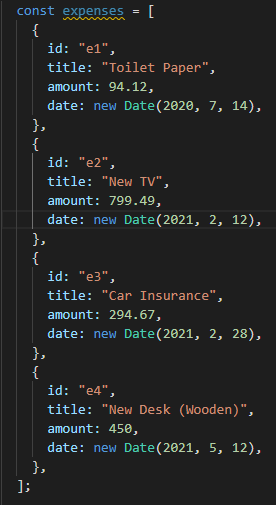
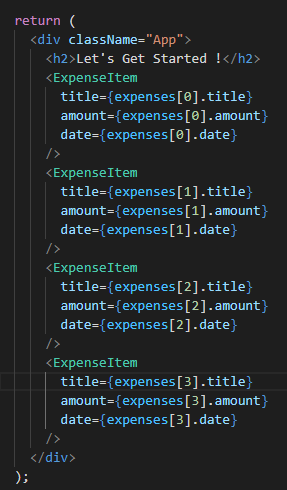
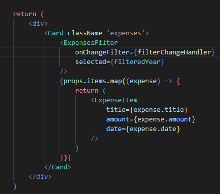
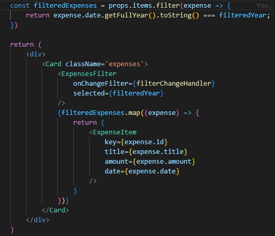

# Rendering Lists of Data

Sekarang kita sudah bisa membuat komponen dan event, dan juga kita sudah bisa melakukan passing data dari parent ke child menggunakan `props`. Ada satu konsep yang nantinya kita akan pakai yang berhubungan dengan menampilkan data menggunakan props.

Bisa kita lihat props items menerima variabel yaitu `expenses`, bisa kita lihat bahwa `items` berbentuk array. Kemudian untuk menampilkannya kita memanggil arrayu tersebut dengan sebanyak nya indexnya. Hal ini bersifat tidak praktis dikarenakan bentuk array `expenses` ini bersifat statis, jadi bagaimana jika bentuknya dinamis. Hal ini dapat memunculkan error dikarenan index yang diminta tidak ada.

Solusi yang kita bisa gunakan adalah menggunakan `map` yaitu function built in dari javascript. Untuk penggunaannya adalah seperti dibawah ini:

Menggunakan `map` seperti diatas akan kita selalu gunakan ketika kita ingin melakukan render data yang bersifat array.

Ada satu hal yang perlu diperhatikan ketika kita ingin menampilkan list data dengan suatu kondisi yaitu `kita tidak perlu berpikir terlalu complicated yaitu seperti menambahkan state atau semacamnya`. Contohnya adalah dibawah :

Bisa dilihat bahwa kita tidak perlu menambahkan suatu state baru untuk menghandle list data ketika diberi filter yaitu `filteredYear`. Kita bisa langsung melakukan filter data dan mengembalikan arraynya secara langsung.

### [Back To React Index](../../README.md)

