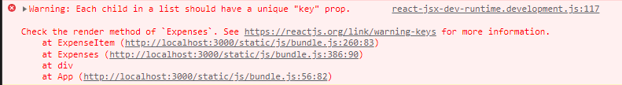
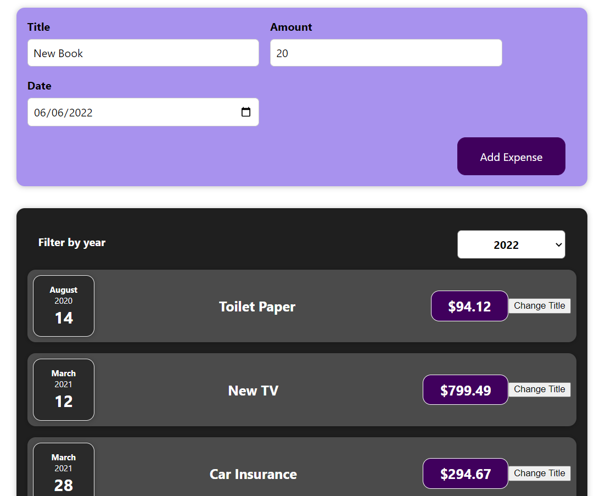
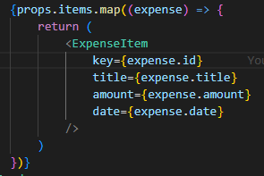

# Mengerti Tentang Keys

Kita sudah menggunakan list dengan state pada aplikasi kita, tetapi jika kita lihat pada `console.log` browser kita, kita akan melihat sebuah error seperti dibawah ini.

Kemudian timbul pertanyaan mengapa error ini muncul padahal list yang ditampilkan seprertinya baik-baik saja. Jadi ada suatu kasus seperti dibawah ini ketika kita akan menambahkan suatu item baru pada list yang telah dirender.

Ketika kita menambahkan item pada list maka tampilan pada browser akan terlihat `berkedip`. Hal ini terjadi karena ketika ada suatu item baru yang ditambahkan react hanya menambahkan satu div baru untuk komponent tersebut, kemudian react akan membaca satu persatu item didalam list tersebut satu persatu lagi dan mengupdate kontentnya satu persatu. Secara tampilan data sudah benar, tetapi dalam perihal performance hal ini tidak bagus, karena semua item dicek kembali dan diupdate kembali dan bahkan hal ini dapat membuat bug yang takdiinginkan.

Salah satu bug yang dapat terjadi adalah dari list tersebut datanya tidak bertambah tetapi malah ter replace. Hal ini terjadi karena `React hanya melakukan checking terhadap panjang dari list terhadap jumlah items yang telah di render.`. Dan karena semua item kelihatan sama react tidak tahu dimana dia harus menambah itemmnya.

Jadi untuk mengatasinya sebenarnya React memiliki suatu konsep agar bisa melakukan update dan render sebuah list secara efisien tanpa performace loss atau bahkan bug yaitu dengan props yang bernama `key`. Props ini bisa diberikan terhadap custom component maupun html yang bersifat built in.

Setelah kita menambahkan key seperti diatas react dapat mengenali dimana dia harus menambah elemen baru. Ada satu hal yang perlu diperhatikan dari ketika memberi key, sebenarnya ketika kita melakukan maps kita bisa memberikan `index` dengan menuliskan `(expense,index)` tetapi hal ini tidak disarankan karena indext tersebut tidak benar-benar menempel pada komponennya. Key juga harus bersifat unik.

### [Back To React Index](../../README.md)

