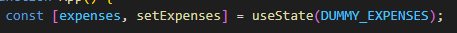
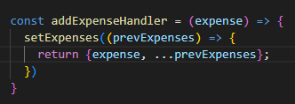

# List Menggunakan State

Kali ini kita akan membahas cara membuat list dengan state. Kita sudah tahu bahwa komponen pada react tidak akan rerender jika kita tidak menggunakan `useState` maka dari itu untuk menyimpan list kita, pertama kita akan membuat `useState`.

Kemudian kita akan tambahkan event untuk menambahkan item baru pada list di state tersebut. Jangan lupa karena list yang ingin ditambahkan kita hanya menambahkan dari list yang lama kita akan menggunakan `prevState` karena kita membutuhkan dependensinya.

### [Back To React Index](../../README.md)

