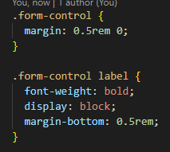
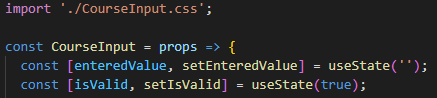
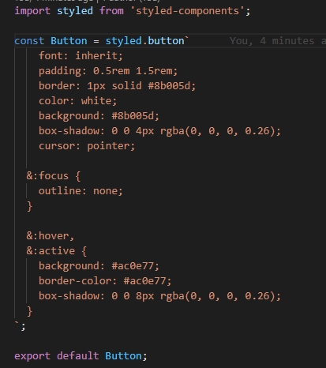
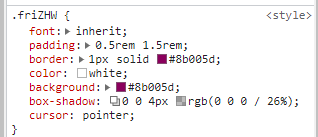

# Memperkenalkan Styled Components

Kita sudah mengenal cara memberikan style pada komponen kita menggunakan regular css, untuk membeerikan CSS ini kita biasa menggunakan selector class atau bahkan tag.

Ada satu hal yang perlu diperhatikan ketika melakukan import file CSS dalam komponen kita, yaitu style tersebut tidak benar-benar hanya mempunyai `scope` pada komponen tersebut.

Yang artinya adalah jika ada class atau juga tag yang mempunyai nama sama pada komponen lain, maka style tersebut akan bocor pada komponen lainnya.

Untuk mengatasi hal ini ada beberapa cara yang paling populer dilakukan:

## 1.Styled Components

Salah satu cara yang dapat kita lakukan adalah menambahkan sebuah library yang bernama `styled-components`. `Styled Components` memberikan kita cara agar kita dapat membuat suatu komponen HTML yang dapat kita berikan suatu style dan hasilnya akan menghasilkan komponen HTML tersebut dengan `class` spesifik dengan style yang kita sudah inputkan.

Yang perlu kita lakukan dalam menggunakan styled components adalah pertama kita instal library styled components. Kemudian kita tinggal library terus dengan menggunakan `styled` kemudian diberi dot dan kita panggil nama komponen HTML apa yang kita mau buat. Setelah kita berikan `backtick` yang ditengahnya dapat diisi dengan style dari komponen HTML yang ingin kita buat. Yang perlu diperhatikan dalam styled ini adalah dia menggunakan `Tagged Template` untuk code style nya dan juga css didalam nya sudah support penulisan seperti `SCSS`.

