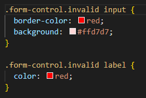
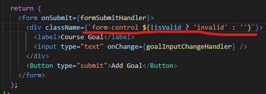

# Melakukan Setting CSS Classes Secara Dinamis

Kita sudah bisa melakukan setting CSS inline secara dinamis, sebenarnya cara ini sudah bisa digunakan tetapi ada cara yang lebih baik sehingga tidak memenuhi komponennya. Yaitu dengan cara menambahkan style css dengan suatu class tertentu dan memberikan class tersebut secara dinamis pada komponennya.

Langkah pertama kita berikan suatu style baru dengan nama class yang kita inginkan:

Dan untuk melakukan dynamic class changenya mirip dengan dynamic inline yaitu seperti dibawah ini

### [Back To React Index](../../README.md)
