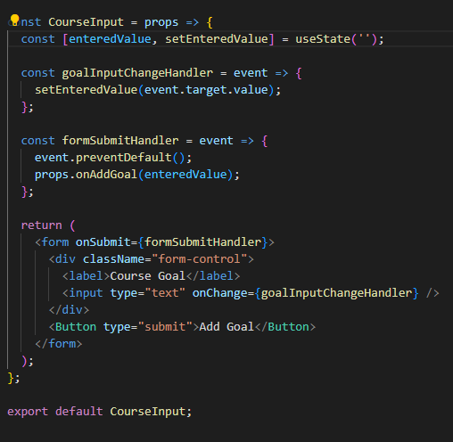
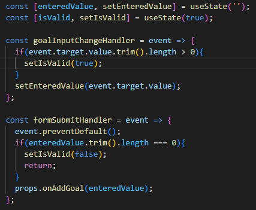
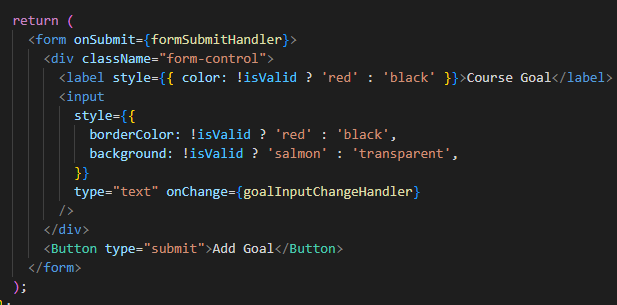

# Melakukan Setting Inline Styles Secara Dinamis

Kita sudah belajar dari sub chapter terakhir bahwa melakukan styling juga salah satu hal yang penting selain functionalitas. Salah satu konsep yang sudah kita pelajari adalah kita bisa melakukan styling secara dinamis menggunakan React. Pada chapter ini ktia akan belajar tentang melakukan setting inline styles secara dinamis.

Bisa kita lihat dari code diatas kita mempunyai sebuah form simple yang dapat kita enchance dalam hal styling, yaitu mengubah style label dan input ketika adanya sebuah error. Dalam hal ini kasusnya adalah ketika input yang dikirimkan adalah inputan kosong.

Langkah pertama yang dilakukan adalah memberikan sebuah `state` dan `logic` sebagai acuan dimana kita membutuhkan perubahan style.

State yang kita gunakan sebagai acuan style kita adalah `isValid`, state ini dilakukan perubahan nilai ketika form nya di submit dan juga ketika setiap ada perubahan pada goal input.

Kemudian kita masuk kedalam pembahasan utama chapter ini yaitu melakukan setting inline styles.

Bisa kita lihat bahwa cukup mudah untuk melakukan setting style inline yaitu pada props `style` kita berikan sebuah logika if else pada css props yang kita inginkan.

### [Back To React Index](../../README.md)
