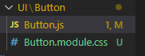
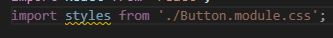
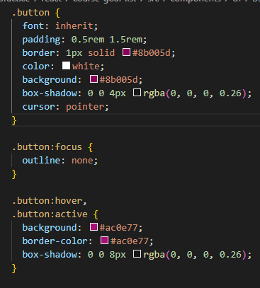
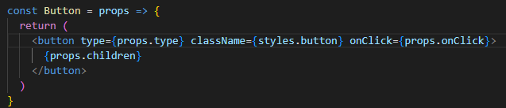
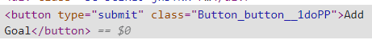
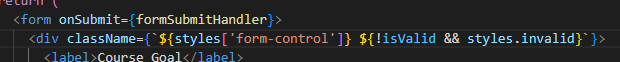

# Perkenalan CSS Modules

Cara lain yang dapat kita gunakan selain menggunakan styled component adalah suatu konsep yang bernama `CSS Modules`. Ketika kita membuat project menggunakan perintah `create-react-app` library ini sudah ikut terinstal.

## Cara Penggunaan:

1. Cara yang pertama adalah file css kita yang berisi styling dari komponent kita, kita ubah dengan menambahkan nama yaitu module. Contoh `Button.css` menjadi `Button.module.css`.

2. Kemudian kita panggil file tersebut dengan menggunakan nama styles dan kita import dari file css module tersebut.

3. Kemudian pada tag HTML yang kita inginkan kita panggil `styles` diikuti dengan nama selector class yang kita inginkan.

Dibawah ini sudah disediakan selector dengan nama `button`.

Dan pada tag HTML nya kita panggil `styles.button`

Hasilnya adalah seperti dibawah ini:

## Bagaimana dengan dinamis style ?

Untuk melakukan styling dinamis kita bisa memberikan logika tambahan didalam classname nya dan hasilnya adalah stylesnya yang telah disediakan.

### [Back To React Index](../../README.md)
