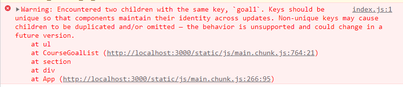

# Menganalisa Code Flow dan Warnings

Hal yang perlu perhatikan selanjutnya adalah yaitu error yang tidak menyebabkan `crash` atau stopper pada aplikasinya. Error jenis ini tidak akan muncul pada IDE tetapi untuk melihatnya kita bisa lihat pada bagian `console` pada web browser kita.

Jenis warning ini memang tidak akan menyebabkan crash, tetapi warning ini bisa saja membuat aplikasi kita tidak berjalan secara benar. Contoh dari warning diatas adalah adanya dua children dengan key yang sama, jika hal ini dibiarkan maka ketika kita melakukan penghapusan children bisa saja children yang salah yang akan terhapus.

Untuk melakukan track warning ini kita diberi petunjuk dimana error itu mungkin berada. Kita harus melakukan analisa flow code dari warning tersebut untuk menemukannya.

### [Back To React Index](../../README.md)

