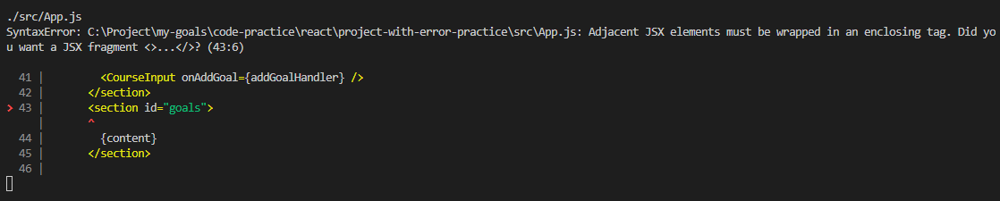
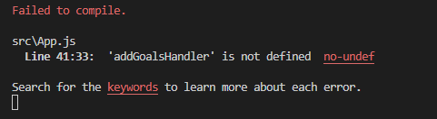

# Mengenali React Error Messages

Dalam membuat suatu aplikasi kita tidak akan mungkin terlepas dengan yang namanya error. Bagi beberapa orang jika menemui suatu `bug` mereka lebih suka menanyakan masalah tersebut ke senior mereka. Tetapi akan lebih baik jika kita bisa menghandle masalah ini sendiri.

Dibawah ini adalah salah satu contoh React Error Messages:

Seperti bisa kita lihat diatas adalah salah satu bentuk error yang bisa kita lihat didalam IDE kita. Mulai dari atas kita bisa lihat yaitu file apa error berada, kasus diatas adalah file bernama `./src/App.js`. Kemudian dibawahnya adalah alasan mengapa file tersebut error, pada kasus ini adalah `Adjacent JSX elements must be wrapper in an enclosing tag` yang artinya JSX element yang berdampingan harus di wrap dengan tag yang sama. Kemudian di bawahnya adalah ilustrasi line berapa error berada, dimana memudahkan kita untuk memudahkannya.

Diatas tersebut adalah salah satu contoh error dimana kita sangat jelas tahu apa yang menyebabkan error dan dimana letak errornya. Error yang sangat jelas lainnya adalah suatu typo.

Begitulah cara mengetahui React Error Messages dengan membaca dari pesan IDE nya.

### [Back To React Index](../../README.md)

