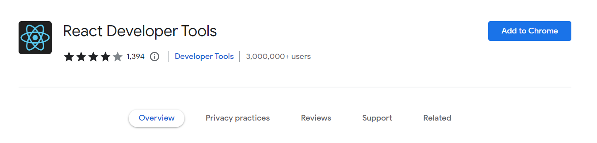
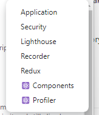
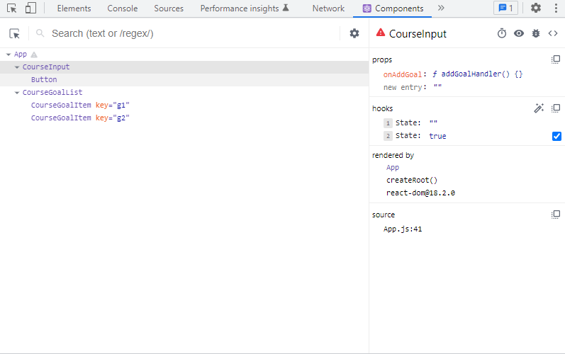

# Menggunakan React Dev Tools

Ada salah satu tool yang banyak digunakan untuk melakukan debugging pada aplikasi React. Tool tersebut bernama `React Developer Tools`.

Jika kita sudah menambahkan addon tersebut kedalam browser kita, maka ketika membuka browser Dev Tools kita akan melihat dua tab baru yaitu `Components` dan `Profiler`.

## A. Components

Jika kita membuka tab `Components` ini kita bisa melihat struktur dari komponent kita. Selain itu kita bisa melihat props, hooks, dirender oleh komponen apa dan nama file nya.

Tampilan ini berbeda dengan hasil tampilan pada tab `Element` dikarenakan tampilan pada tab `Components` ini lebih mewakilkan tampilan App React.

### [Back To React Index](../../README.md)
