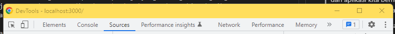
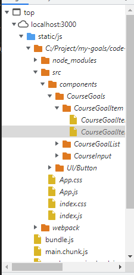
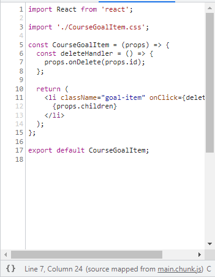
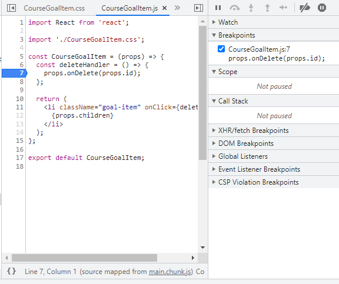
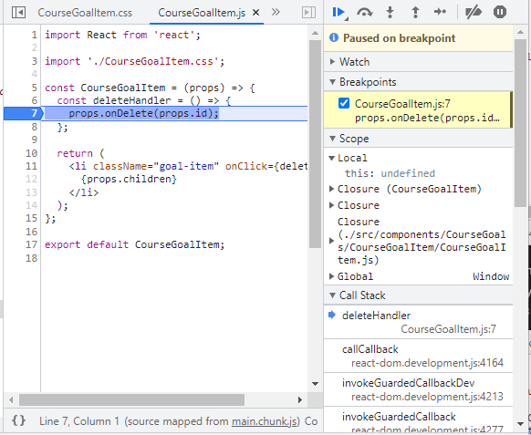
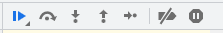

# Bekerja dengan Breakpoints

Ada satu lagi cara yang dapat kita gunakan untuk melakukan debugging menggunakan browser kita sendiri, yaitu dengan cara memberikan `Breakpoints`. `Breakpoints` adalah dimana suatu titik yang kita tentukan membuat proses dari aplikasi kita berhenti sementara, kemudian kita bisa menganalisa proses apa saja yang sedang berlangsung dan juga variabel apa saja yang sedang tersedia. `Breakpoints` yang dapat kita berikan berjumlah tidak terbatas.

Hal pertama yang kita lakukan ketika akan memberikan `Breakpoints` adalah dengan membuka DevTools dari browser. Kemudian kita buka tab bagian `source`.

Kemudian bagian paling kira kita cari file dimana kita akan memberikan `Breakpoints`.

Kemudian jika kita klik suatu file yang kita inginkan, maka akan muncul code yang ada pada file tersebut.

Untuk menambahkan `Breakpoints` kita hanya perlu mengklik angka baris kode yang ingikan. Jika berhasil maka akan muncul warna `biru` yang menandakan sudah diberinya `Breakpoints` selain itu bagian paling kanan tab tersebut akan menuliskan adanya `Breakpoints`.

Kemudian untuk memulai lakukan pengecekan `Breakpoints` kita bisa mengtrigger function tersebut. Dan jika function tersebut tertrigger maka line code tersebut akan bernawa biru dan proses akan seketika berhenti agar kita bisa melakukan pengecekan atau debugging.

Disini kita bisa melihat apa saja yang terjadi pada titik tersebut dan kemudian kita bisa menggunakan command pada tab paling kanan untuk melanjutkan proses, mulai dari next function atau prev function dll.

### [Back To React Index](../../README.md)

