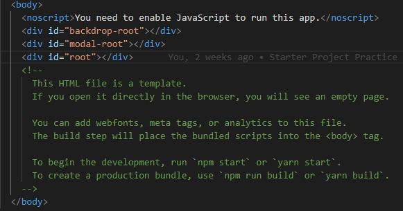
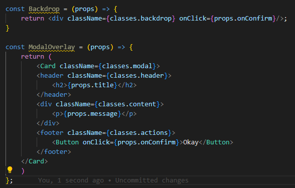
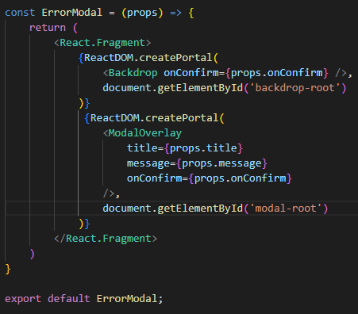

# React Portals

## A. Mengapa kita butuh React Portal ?

Kita sudah mengetahui cara membuat code yang lebih clean menggunakan `React.Fragment`. Tetapi mari kita lihat code dibawah ini.

```tsx
return(
    <React.Fragment>
        <MyModal />
        <MyInputForm />
    </React.Fragment>
)
```

Dari code diatas kita bisa lihat menggunakan `React.Fragment`, DOM yang dihasilkan bersifat sudah clean. Tetapi lihat lah hasil dari render aplikasi secara keseluruhan.

```html
<section>
    <h2>Some other content</h2>
    <!-- React Fragment Result -->
    <div class='my-modal'>
        <h2>A Modal Title</h2>
    </div>
    <form>
        <label>Username</label>
        <input type='text' />
    </form>
     <!-- React Fragment Result -->
</section>
```

Yang perlu kita perhatikan dari code diatas adalah secara proses tidak ada yang aneh semuanya akan berjalan baik. Tetapi secara `Semantic` atau `secara arti penulisan` perlu kita perhatikan bahwa `Modal` berada ditengah-tengah nested komponent. Padahal yang secara kita tahu bahwa `Modal` seharusnya bersifat overlay dari semua komponen yang ada. Hal ini juga membuat secara `Accessibility` atau bagaimana bantuan terhadap pengguna disabilitas akan mengartikan secara tidak baik karena pembacaan dari screen reader yang berantakan.

Contoh yang lain berhubungan dengan `Semantic` dan `Accessibility` adalah seperti dibawah ini:

```tsx
<div onClick={clickHandler}>Click me, I'm a bad button.</div>
```

Kita bisa membuat button dengan menggunakan `div` dan bekerja layaknya seperti sebuah `Button` tetapi kita menggunakan sebuah `div` hal itu akan membuat programmer lainnya yang akan mengerjakan bingung maupun kesusahan.

Dengan kasus Modal yang berada tidak pada tempatnya tersebut diperkenalkan lah dengan sebuah konsep React yang bernama `Portals`.

<br>

## B. Definisi Portals

Definisi resmi dari Portals yang ada pada website React menyebutkan seperti ini:

`
Portals provide a first-class way to render children into a DOM node that exists outside the DOM hierarchy of the parent component.
`

Yang artinya adalah Portasl menyediakan cara terbaik untuk melakukan render sebuah children terhadap suatu DOM yang letaknya berada di luar hierarki DOM dari komponen parentnya.

<br>


## C. Cara menggunakan Portals
<br>


### 1. Menyiapkan Port

Port yang dimaksud disini adalah dimana output dari komponen kita akan dirender. Untuk membuat port kita hanya butuh `div` dengan Id yang spesifik.



Pada contoh diatas kita menyediakan dua div baru yaitu dengan `id` backdrop-root dan modal-root. Kedua div tersebut akan menjadi Port dari Portals yang akan kita buat.

### 2. Menyiaplan Komponen yang akan di Portal

Setelah itu kita siapkan komponen yang kita ingin arahkan menuju Port yang telah kita sediakan seperti dibawah ini.



### 3. Gunakan React Portals

Kita import terlebih dahulu library `ReactDOM` yang dimana didalamnya terdapat `Portals`.

```tsx
import ReactDOM from 'react-dom';
```

Kemudian pada komponen kita, kita tuliskan seperti dibawah ini:



Bisa kita lihat seperti diatas bahwa untuk menggunakan `Portal` kita menggunakan sebuah function yang berada didalam React.DOM yaitu `createPortal`. Function ini menerima dua parameter yaitu `jsx element yang ingin dirender` dan `target element DOM`. Yang perlu diperhatikan adalah ketika perlu menggunakan document.getElementById untuk mencari target element kita.

Jika semua langkah tersebut sudah dilakukan maka DOM kita akan di render pada target elemen yang kita inginkan.

### [Back To React Index](../../README.md)


