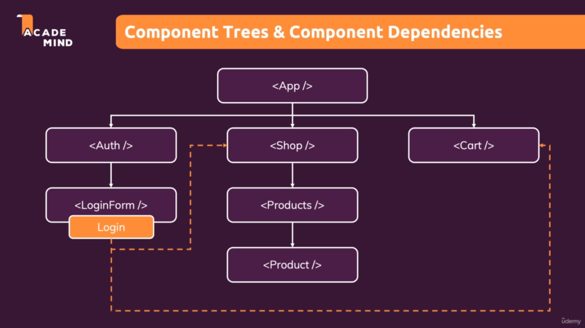
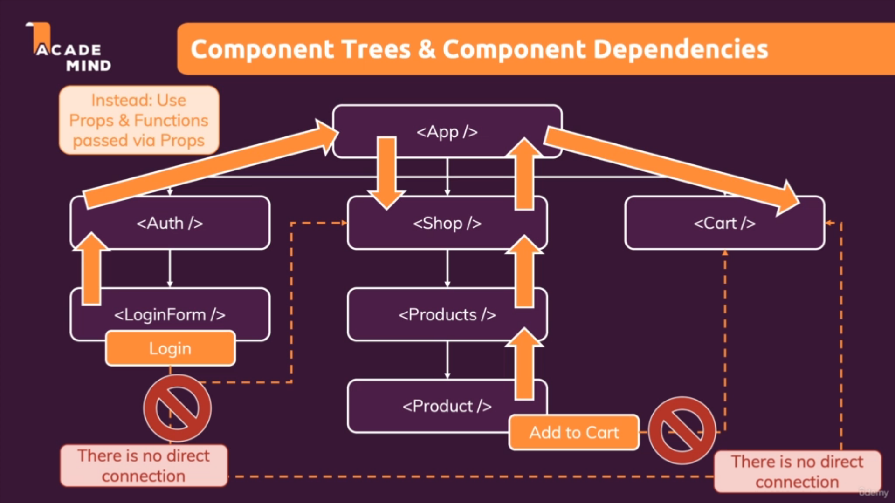
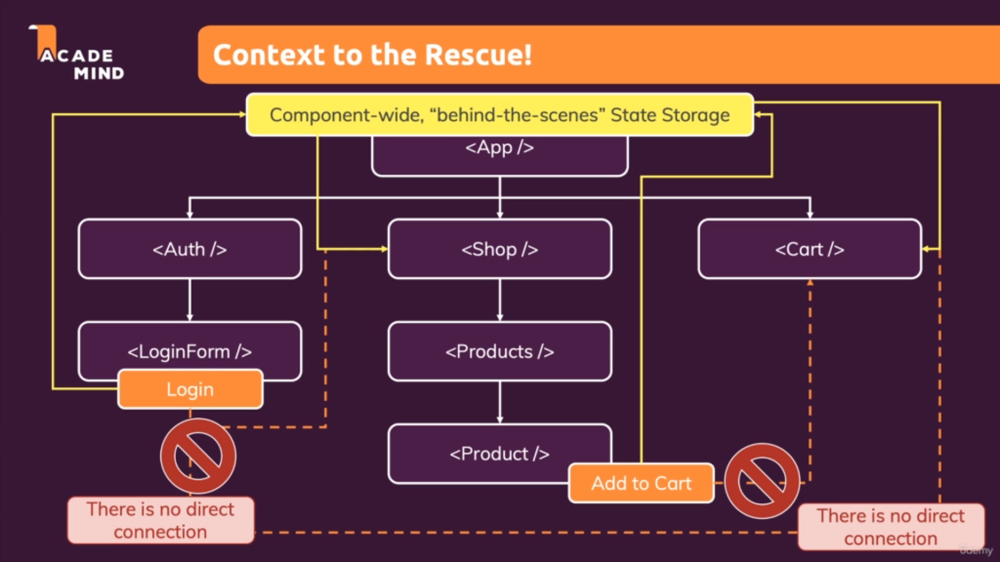
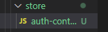
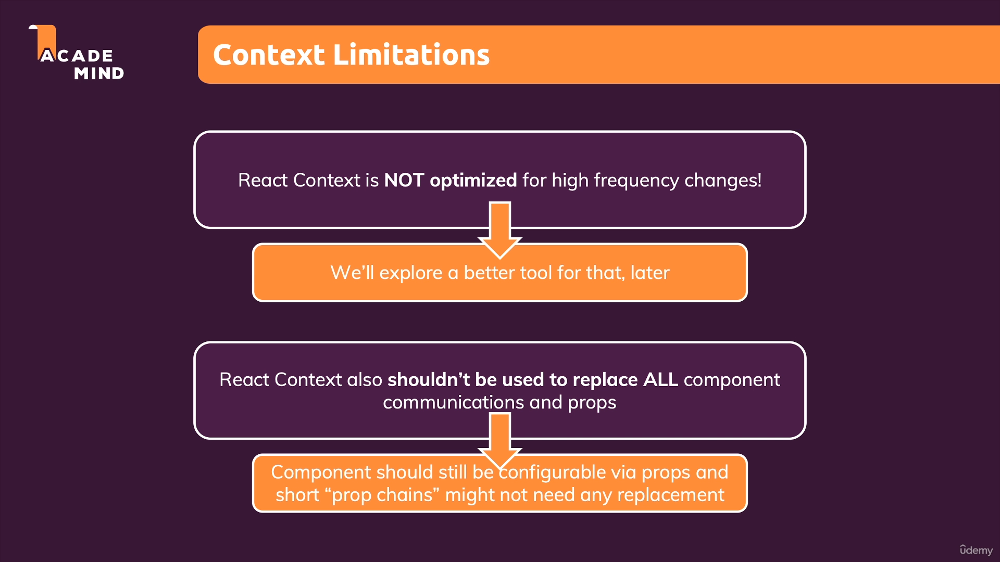

# Context

## 1. Perkenalan

Kita sudah mempelajari tentang useEffect dan juga useReducer yang keduanya merupakan state management. Setelah itu kita akan mengenal suatu state management lainnya yaitu adalah `Context`. Tetapi sebelum itu lihatlah code dibawah ini:

```tsx
    const [isLoggedIn, setIsLoggedIn] = useState(false);

    return (
    <React.Fragment>
      <MainHeader isAuthenticated={isLoggedIn} onLogout={logoutHandler} />
      <main>
        {!isLoggedIn && <Login onLogin={loginHandler} />}
        {isLoggedIn && <Home onLogout={logoutHandler} />}
      </main>
    </React.Fragment>
  );
```

Kita bisa lihat code diatas kita menggunakan state `isLoggedIn` di beberapa component dibawah parent component isLoggedIn. Hal ini dikarenakan pengecekan login ini bersifat global dimana bahkan akan lebih banyak komponen yang menggunakan props ini. Tetapi yang perlu diperhatikan adalah code komponen `MainHeader` dibawah ini.

```tsx
const MainHeader = (props) => {
  return (
    <header className={classes['main-header']}>
      <h1>A Typical Page</h1>
      <Navigation isLoggedIn={props.isAuthenticated} onLogout={props.onLogout} />
    </header>
  );
};
```

Bisa kita lihat bahwa pada `MainHeader` props `isAuthenticated` yang menggunakan `isLoggedIn` hanya `dilempar` tanpa ada penggunaan yang terlihat di komponen ` MainHeader`. Hal ini tidak sepenuhnya salah tetapi bagaimana pada contoh dibawah ini:



Pada gambar diatas kita bisa lihat bahwa kita menggunakan suatu state yang seharusnya berada pada komponen `LoginForm` tetapi kita juga menggunakan state  tersebut pada komponen `Shop` dan `Cart`. Contoh lainnya adalah dibawah ini:


Pada komponen `Product` kita mempunyai function bernama `Add to Cart` yang dimana kita mempunyai function yang dimana kita menambahkan data pada state yang berada di komponen `Cart`.




Kita bisa menyimpulkan bahwa kedua hal tersebut mengindikasikan bahwa tidak ada koneksi secara langsung antar state dan komponen yang akan digunakan. Sebenarnya kita bisa membuat work around yaitu dengan menaruh state di komponen di level yang tertinggi. Tetapi sama yang dijelaskan tadi nantinya akan ada banyak komponen yang hanya akan melemparkan state tanpa menggunakannya sama sekali.



Diatas sebenarnya adalah penggambaran state storage secara garis besar dari semua komponen.

Konsep context ini adalah dimana kita dapat menyimpan sebuah state didalam store dan dapat memanggil store tersebut dari komponen manapun didalam aplikasi kita.

<br />

## 2. Pembuatan React Context

### a. Buat Folder bernama store dan file yang dibutuhkan



Untuk menyimpan semua file yang berhubungan dengan context ini kita akan membuat sebuah folder yang bernama `store`.

Dan untuk contoh kali ini kita akan membuat sebuah file yang nantinya akan melakukan management dari login. File ini kita beri nama yaitu `auth-context` dengan kebap case, kita bisa menggunakan kebap case tetapi bagi beberapa orang mereka juga terkadang menggunakan pascal case `AuthContext`, tetapi jika menggunakan pascal case nantinya bisa dianggap bahwa file ini mengembalikan sebuah komponen. Sehingga lebih disarankan menggunakan kebap case saja.

### b. Membuat Context

Kita menuliskan context pertama kita dengan nama `AuthContext` 
```tsx
import React from 'react';

const AuthContext = React.createContext({
    isLoggedIn: false,
});

export default AuthContext;
```

### c. Membuat Provider Context Tersebut

Hal penting yang perlu kita lakukan selanjutnya adalah membuat sebuah `provider` yang melakukan wrap jsx code kita, agar react tahu bahwa kita sudah membuat sebuah context yang dapat digunakan. Lihatlah kode dibawah ini:

```tsx
return (
    <AuthContext.Provider>
      <MainHeader isAuthenticated={isLoggedIn} onLogout={logoutHandler} />
      <main>
        {!isLoggedIn && <Login onLogin={loginHandler} />}
        {isLoggedIn && <Home onLogout={logoutHandler} />}
      </main>
    </AuthContext.Provider>
  );
```

Kita menggunakan `<NamaContext.Provider>` dikarenakan untuk melakukan wrap kita membutuhkan komponen, dan `Provider` disini mengembalikan komponen yang melakukan wrap semua children didalamnya.

### d. Membuat Listener

Karena kita sudah membuat provider selanjutnya kita akan membuat `Listener` yaitu dimana kita akan mengconsume `Context` yang sudah kita `Provide`. Untuk membuat listener ini ada dua cara yang dapat digunakan yaitu menggunakan `React.Hook` dan `Consumer`.

#### i. Menggunakan Consumer

Untuk menggunakan consumer kita perlu menambah `<NamaContext.Consumer>` pada komponen yang akan menggunakan context tersebut. Yang perlu diingat bahwa `Consumer` akan melakukan wrap pada komponen tersebut dan `return` nya adalah sebuah function dengan satu parameter yaitu `context` itu sendiri.

```tsx
const Navigation = (props) => {
  return (
    <AuthContext.Consumer>
      {(ctx) => {
        return (
          <nav className={classes.nav}>
            <ul>
              {ctx.isLoggedIn && (
                <li>
                  <a href="/">Users</a>
                </li>
              )}
              {ctx.isLoggedIn && (
                <li>
                  <a href="/">Admin</a>
                </li>
              )}
              {ctx.isLoggedIn && (
                <li>
                  <button onClick={props.onLogout}>Logout</button>
                </li>
              )}
            </ul>
          </nav>
        )
      }}
    </AuthContext.Consumer>
  );
};

export default Navigation;
```

Kode diatas sebenarnya akan menghasilkan error dikarenakan `isLoggedIn` tidak ditemukan atau undefined. Kita memang sudah memberikan nilai default ke context kita seperti dibawah ini:

```tsx
const AuthContext = React.createContext({
    isLoggedIn: false,
});
```

Tetapi nilai default tersebut sebenarnya hanya akan dipakai ketika `Consumer digunakan tanpa adanya Provider`. Jadi mengapa kita membutuhkan provider ?, jawabannya adalah provider ini digunakan agar nilai pada context dapat diubah-ubah sesuai kebutuhan kita.

Untuk menghindari crash yang terjadi kita akan menambahkan `value` pada provider yang telah kita buat.

```tsx
const [isLoggedIn, setIsLoggedIn] = useState(false);

 <AuthContext.Provider
      value={{
        isLoggedIn: isLoggedIn,
      }}
    >
      <MainHeader onLogout={logoutHandler} />
      <main>
        {!isLoggedIn && <Login onLogin={loginHandler} />}
        {isLoggedIn && <Home onLogout={logoutHandler} />}
      </main>
</AuthContext.Provider>
```

Diatas kita mempunyai state local yang digunakan untuk menghandle proses log in, maka dari itu nilai tersebut kita lempar kedalam `context` kita. Agar semua child componen yang diwrap oleh provider akan menerima semua update dari perubahan nilai value context. Karena kita sudah menggunakan context kita bisa menghapus semua `props chain` yang ada didalam semua komponen.

Ada satu kekurangan dari penggunaan `Provider` ini yaitu adalah penulisan `Consumer` nya yang menggunakan function tidak enak untuk dibaca.

#### ii. Menggunakan useContext Hook

Untuk menggunakan useContext hook sangat simpel sekali, kita hanya perlu memanggil `useContext` dari library React. Kemudian hook ini hanya menerima satu parameter yaitu context yang akan dipakai. Lihatlah kode dibawah ini:

```tsx
const Navigation = (props) => {
  const ctx = useContext(AuthContext);

  return (
    <nav className={classes.nav}>
      <ul>
        {ctx.isLoggedIn && (
          <li>
            <a href="/">Users</a>
          </li>
        )}
        {ctx.isLoggedIn && (
          <li>
            <a href="/">Admin</a>
          </li>
        )}
        {ctx.isLoggedIn && (
          <li>
            <button onClick={props.onLogout}>Logout</button>
          </li>
        )}
      </ul>
    </nav>
  );
};

export default Navigation;
```

Dalam context kita tidak hanya bisa menyimpan variable, tetapi kita juga bisa menyimpan function untuk diakses dimanapun. Lihatlah contoh dibawah ini:

Pada context kita tambahkan default nilai function yaitu function kosong.
```tsx
const AuthContext = React.createContext({
    isLoggedIn: false,
    onLogout: () => {},
});
```

Kita Tambahkan value pada provider kita:

```tsx
 return (
    <AuthContext.Provider
      value={{
        isLoggedIn: isLoggedIn,
        onLogout: logoutHandler,
      }}
    >
      <MainHeader isAuthenticated={isLoggedIn} onLogout={logoutHandler} />
      <main>
        {!isLoggedIn && <Login onLogin={loginHandler} />}
        {isLoggedIn && <Home onLogout={logoutHandler} />}
      </main>
    </AuthContext.Provider>
  );
```

Dan untuk penggunaanya juga cukup simpel:

```tsx
 {ctx.isLoggedIn && (
    <li>
      <button onClick={ctx.onLogout}>Logout</button>
    </li>
  )}
```

<br />

## 3. Props VS Context

Ada hal yang sangat mendasar dimana kita perlu menggunakan props atau context adalah yaitu ketika apa yang kita lempar kedalam child component langsung digunakan maka kita akan memakai `props`. Tetapi jika apa yang kita lempar masih dilempar lagi tanpa benar-benar dipakai maka kita akan menggunakan `context` untuk menghindari `props chain`. Maka dari itu kesimpulannya adalah tingkatan penggunaan `props` hanyalah satu level dibawah parent component.

<br />

## 4. Structure Context Yang Disarankan

Dibawah ini adalah salah satu cara yang disarankan dalam membuat custom context provider yaitu untuk proses `Login`.

### a. Membuat Context

Secara konsep kita seharusnya mengurangi banyak logic dan code yang kita taruh di `App`, maka dari itu semua proses yang berhubungan dengan provider lebih baik kita taruh didalam file `context`. Contoh:

```tsx
import React, { useState, useEffect } from 'react';

const AuthContext = React.createContext({
    isLoggedIn: false,
    onLogout: () => { },
    onLogin: (email, password) => {},
});

export const AuthContextProvider = (props) => {
    const [isLoggedIn, setIsLoggedIn] = useState(false);

    useEffect(() => {
        // Get isLoggedIn Data from Local Storage
        const storedUserLoggedInformation = localStorage.getItem('isLoggedIn');

        // Do Checking of stored user information
        if (storedUserLoggedInformation === '1') {
            setIsLoggedIn(true);
        }
    }, []);

    const loginHandler = (email, password) => {
        // We should of course check email and password
        // But it's just a dummy/ demo anyways

        // Save isLoggedIn to Local Storage
        // We Using 1 for logged in and 0 if doesnt
        localStorage.setItem('isLoggedIn', '1');
        setIsLoggedIn(true);
    };

    const logoutHandler = () => {
        // Remove Local Storage Data
        localStorage.removeItem('isLoggedIn');
        setIsLoggedIn(false);
    };

    return (
        <AuthContext.Provider
            value={{
                isLoggedIn: isLoggedIn,
                onLogout: logoutHandler,
                onLogin: loginHandler,
            }}
        >
            {props.children}
        </AuthContext.Provider>
    )
}

export default AuthContext;
```

Secara default kita akan export yaitu AuthContext, tetapi kita juga menyediakan export untuk Providernya.

### b. Wrap App dengan Provider

Pada file `index.js` context kita akan melakukan wrap pada komponen `App` nya.

```tsx
root.render(
    <AuthContextProvider>
        <App />
    </AuthContextProvider>
);
```

### c. Panggil nilai context dimanapun dibutuhkan

Sisanya kita dapat menggunakan context dimanapun nilainya dibutuhkan:

```tsx
function App() {
  const ctx = useContext(AuthContext);

  return (
    <React.Fragment>
      <MainHeader />
      <main>
        {!ctx.isLoggedIn && <Login />}
        {ctx.isLoggedIn && <Home />}
      </main>
    </React.Fragment>
  );
}

export default App;
```

<br />

## 5. Limitasi Context



### [Back To React Index](../../README.md)


