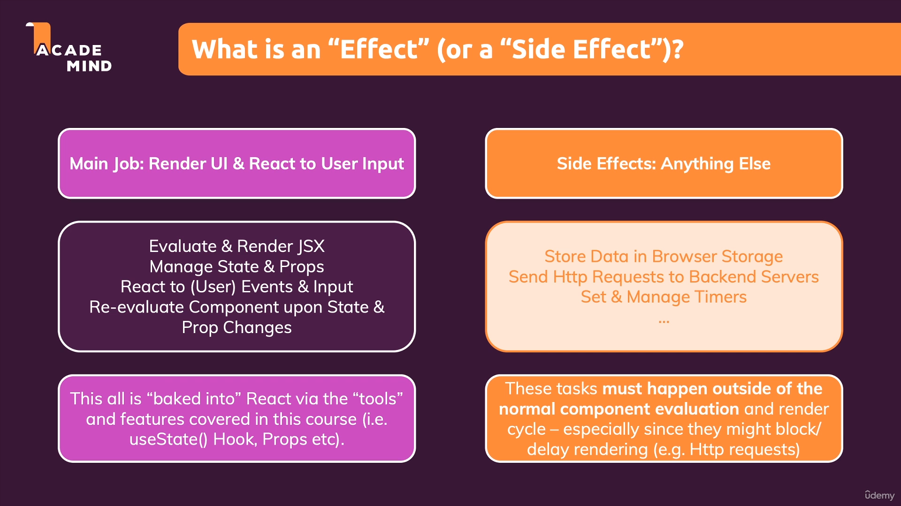
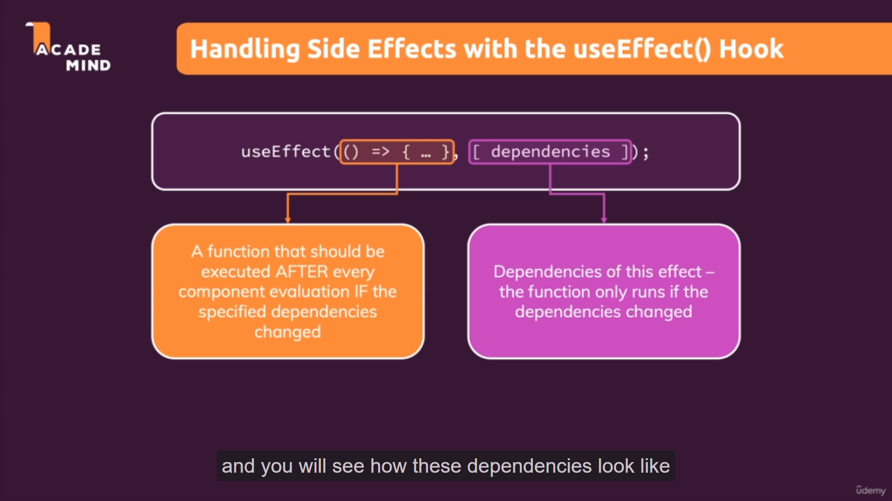
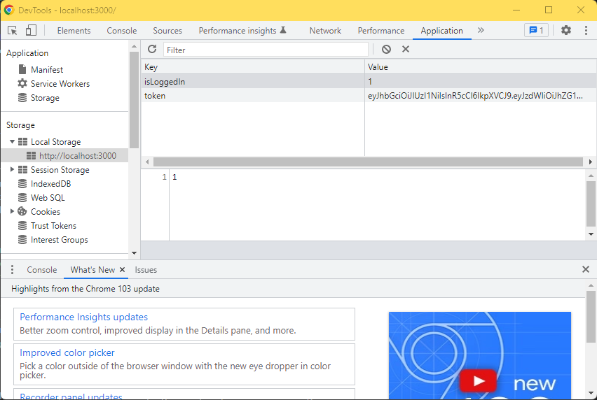
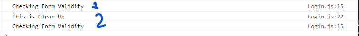

# Effect ( Side Effect )

## 1. Perkenalan



Pertama kita sudah kita ketahui bahwa tugas utama dari React adalah melakukan Render UI dan juga melakukan perubahan UI berdasarkan event yang dilakukan oleh user seperti menekan tombol maupun melakukan input data. Tugas - tugas tersebut meliputi meng evaluasi dan render JSX kembali, melakukan manage state dan props, melakukan perubahan berdasarkan event dan input dan meng evaluasi komponen kembali berdasarkan perubahan state maupun props. Semua ini terdapat didalam react dan diatur menggunakan tools dan fitur yang ada seperti useState maupun props.

Sedangkan Side Effects adalah segala hal lain yang bisa terjadi di aplikasi kita seperti menyimpan data pada browser storage, mengirimkan Http Request dan melakukan manage terhadap timers. Task - task tersebut harus terjadi diluar evaluasi normal komponen dan render cycle karena bisa saja mereka membuat block atau delay dalam rendering.

Untuk Penulisan useEffect adalah seperti dibawah ini:



Didalam arrow function kita tuliskan sebuah function yang ingin kita jalankan ketika suatu dependencies mengalami perubahan. Dan didalam array setelah itu kita tuliskan apa saja dependencies yang berfungsi sebagai acuan dari useEffect ini.

<br />

## 2. Contoh Penggunaan Effect

Seperti yang kita tahu bahwa salah satu penggunaan Effect yaitu dapat kita gunakan ketika menyimpan data pada browser storage. Lihatlah contoh code tentang login dibawah ini:

```tsx
function App() {
  const [isLoggedIn, setIsLoggedIn] = useState(false);

  const loginHandler = (email, password) => {
    // We should of course check email and password
    // But it's just a dummy/ demo anyways
    setIsLoggedIn(true);
  };

  const logoutHandler = () => {
    setIsLoggedIn(false);
  };

  return (
    <React.Fragment>
      <MainHeader isAuthenticated={isLoggedIn} onLogout={logoutHandler} />
      <main>
        {!isLoggedIn && <Login onLogin={loginHandler} />}
        {isLoggedIn && <Home onLogout={logoutHandler} />}
      </main>
    </React.Fragment>
  );
}

export default App;
```

Dapat dilihat dari code diatas bahwa kita menggunakan state bernama `isLoggedIn` sebagai acuan bahwa user sudah login atau belum. Sekarang kita tambahkan suatu code dimana kita ingin menyimpan data `isLoggedIn` tersebut kedalam local storage browser.
Untuk melakukan hal tersebut kita tambahkan code seperti dibawah ini:

```tsx
  const loginHandler = (email, password) => {
    // We should of course check email and password
    // But it's just a dummy/ demo anyways

    // Save isLoggedIn to Local Storage
    // We Using 1 for logged in and 0 if doesnt
    localStorage.setItem('isLoggedIn', '1');
    setIsLoggedIn(true);
  };
```

Untuk melakukan checking terhadap data yang disimpan pada local storage browser kita bisa melakukan check pada `DevTools` browser dan pada tab `Application` kita cari `Local Storage`.



Penyimpanan pada local storage browser ini berfungsi agar ketika kita melakukan restart aplikasi jika kita sudah login maka kita akan tetap dianggap sudah login. `Hal ini dikarenakan jika menggunakan state isLoggedIn state tersebut akan direset jika aplikasi direstart, karena itu adalah behavior dari useState`.

Hal selanjutnya yang kita lakukan adalah mengambil variable `isLoggedIn` tersebut dari `Local Storage` ketika kita memulai aplikasi kita. Kita coba tambahkan kode seperti dibawah ini:

```tsx
 const [isLoggedIn, setIsLoggedIn] = useState(false);

  // Get isLoggedIn Data from Local Storage
  const storedUserLoggedInformation = localStorage.getItem('isLoggedIn');

  // Do Checking of stored user information
  if(storedUserLoggedInformation === '1'){
    setIsLoggedIn(true);
  }
```

Hal diatas ini dapat menimbulkan `infinite loop` karena ketika ada data `isLoggedIn` sudah ada didalam `Local Storage` maka kita akan melakukan `setIsLoggedIn(true)`, hal ini menyebabkan render ulang karena ada perubahan state `isLoggedIn` dan kemudian komponen tersebut akan membaca kode dari awal lagi dan sampai pada `if` yang sama melakukan pengecekan kembali dan melakukan `setIsLoggedIn(true)` dan seterusnya tanpa berhenti.

Untuk menyelesaikan permasalahan ini kita dapat menggunakan useEffect seperti dibawah ini, dan jangan lupa untuk mengambil useEffect ini dari library React.

```ts
import React, { useEffect } from 'react';

```

```tsx
    useEffect(() => {
        // Get isLoggedIn Data from Local Storage
        const storedUserLoggedInformation = localStorage.getItem('isLoggedIn');

        // Do Checking of stored user information
        if(storedUserLoggedInformation === '1'){
        setIsLoggedIn(true);
        }
    }, []);
```

Kita bisa lihat kita tidak memberi dependencies sama sekali didalam useEffect yang kita gunakan, hal ini berarti kita memberi perintah terhadap useEffect tersebut untuk `jalankan hanya sekali saja ketika aplikasi dimulai`, hal ini sangat penting untuk diingat. Jadi ketika walaupun ada perubahan terhadap state didalam komponen tersebut `useEffect` tersebut tidak akan melakukan function didalamnya karena dependencies nya hanya sekali ketika aplikasinya dimulai.

Dan yang terakhir kita bisa menghapus `Local Storage` kita menggunakan.

```tsx
const logoutHandler = () => {
    // Remove Local Storage Data
    localStorage.removeItem('isLoggedIn');
    setIsLoggedIn(false);
  };
```

<br />

## 3. useEffect dan Dependencies

Sekarang kita akan mencoba menggunakan dependencies pada useEffect pada kasus ini kita akan melihat contoh pada sebuah validasi form. Lihatlah code dibawah ini:

```tsx
import React, { useState } from 'react';

import Card from '../UI/Card/Card';
import classes from './Login.module.css';
import Button from '../UI/Button/Button';

const Login = (props) => {
  const [enteredEmail, setEnteredEmail] = useState('');
  const [emailIsValid, setEmailIsValid] = useState();
  const [enteredPassword, setEnteredPassword] = useState('');
  const [passwordIsValid, setPasswordIsValid] = useState();
  const [formIsValid, setFormIsValid] = useState(false);

  const emailChangeHandler = (event) => {
    setEnteredEmail(event.target.value);

    setFormIsValid(
      event.target.value.includes('@') && enteredPassword.trim().length > 6
    );
  };

  const passwordChangeHandler = (event) => {
    setEnteredPassword(event.target.value);

    setFormIsValid(
      event.target.value.trim().length > 6 && enteredEmail.includes('@')
    );
  };

  const validateEmailHandler = () => {
    setEmailIsValid(enteredEmail.includes('@'));
  };

  const validatePasswordHandler = () => {
    setPasswordIsValid(enteredPassword.trim().length > 6);
  };

  const submitHandler = (event) => {
    event.preventDefault();
    props.onLogin(enteredEmail, enteredPassword);
  };

  return (
    <Card className={classes.login}>
      <form onSubmit={submitHandler}>
        <div
          className={`${classes.control} ${
            emailIsValid === false ? classes.invalid : ''
          }`}
        >
          <label htmlFor="email">E-Mail</label>
          <input
            type="email"
            id="email"
            value={enteredEmail}
            onChange={emailChangeHandler}
            onBlur={validateEmailHandler}
          />
        </div>
        <div
          className={`${classes.control} ${
            passwordIsValid === false ? classes.invalid : ''
          }`}
        >
          <label htmlFor="password">Password</label>
          <input
            type="password"
            id="password"
            value={enteredPassword}
            onChange={passwordChangeHandler}
            onBlur={validatePasswordHandler}
          />
        </div>
        <div className={classes.actions}>
          <Button type="submit" className={classes.btn} disabled={!formIsValid}>
            Login
          </Button>
        </div>
      </form>
    </Card>
  );
};

export default Login;
```

Mungkin kita bertanya-tanya dimana kita dapat menggunakan `useEffect` didalam kode diatas karena kode diatas sepertinya sudah bekerja dengan baik. Tetapi kita bisa tambahkan useEffect untuk melakukan satu kali validasi menggantikan dua redundan validasi di dua function yaitu:

```tsx
 const emailChangeHandler = (event) => {
    setEnteredEmail(event.target.value);

    setFormIsValid(
      event.target.value.includes('@') && enteredPassword.trim().length > 6
    );
  };

  const passwordChangeHandler = (event) => {
    setEnteredPassword(event.target.value);

    setFormIsValid(
      event.target.value.trim().length > 6 && enteredEmail.includes('@')
    );
  };
```

Sekarang kita coba gunakan useEffect sebagai pengganti validasinya seperti dibawah ini:

```tsx
useEffect(() => {
    setFormIsValid(
      enteredEmail.includes('@') && enteredPassword.trim().length > 6
    );
  }, [setFormIsValid, enteredEmail, enteredPassword])
```

Bisa kita lihat pada useEffect diatas salah satu tips untuk apa saja dependencies yang dituliskan didalam array yaitu kita tuliskan semua state, variabel yang digunakan didalam functionnya. Dalam kasus ini ada 3 variabel yang digunakan yaitu `setFormIsValid`, `enteredEmail` dan `enteredPassword`. Kita bisa hilangkan `setFormIsValid` dikarenakan fungsi tersebut akan dipastikan selalu sama oleh React karena function tersebut adalah function set value dari `useState`. Sehingga `useEffect` nya sekarang akan seperti dibawah ini:

```tsx
useEffect(() => {
    setFormIsValid(
      enteredEmail.includes('@') && enteredPassword.trim().length > 6
    );
  }, [enteredEmail, enteredPassword])
```

Karena ada penambahan dua dependencies tersebut maka function didalam `useEffect` tersebut akan berjalan ketika ada perubahan pada `enteredEmail` dan `enteredPassword`.

```tsx
    <div className={classes.actions}>
          <Button type="submit" className={classes.btn} disabled={!formIsValid}>
            Login
          </Button>
    </div>
```

Dan sebagai tambahan kita bisa lihat bahwa button login diatas berpengaruh oleh state `formIsValid` hal ini bisa kita sebut juga sebagai `Side Effect`. Walaupun kita sudah sebutkan bahwa `Effect` hanya digunakan untuk `HTTP`, `Local Storage` atau `Timer`. Tetapi kasus ini juga bisa gunakan `useEffect`.

<br />

## 4. Apa yang boleh ditambahkan dan tidak sebagai Dependencies ?

Seperti yang sebelumnya dijelaskan, kita perlu tambahkan "apapun" yang kita gunakan didalam useEffect function sebagai dependensi. Seperti contoh semua state variables dan functions yang digunakan didalamnya.

Tetapi ada beberapa `pengecualian` yang perlu diperhatikan:

- Kita tidak perlu menambahkan state updating functions (seperti isFormValid pada contoh sebelumnya). React menjamin bahwa function tersebut tidak akan pernah berubah jadi kita tidak perlu menggunakaannya sebagai dependencies.

- Kita juga tidak perlu menambahkan "built-in" APIs atau Functions seperti `fetch()`, `localStorage` dan lain - lain seperti functions atau features yang built-in dari browser dan digunakan secara global. API dan function global ini tidak berhubungan dengan React Component Render Cycle sehingga mereka tidak akan pernah mengalami perubahan

- Kita juga tidak perlu menambahkan variable ata function yang mungkin kita defined diluar komponen kita, seperti jika kita membuat sebuah helper function di file yang terpisah. Fungsi atau variable yang tidak dibuat didalam sebuah component function sehingga merubah mereka tidak akan ada efeknya terhadap komponen kita.

Jadi kesimpulannya, kita harus menambahkan semua "benda" yang digunakan didalam effect function kita jika "benda" tersebut dapat berubah karena komponen kita di render ulang. `Hal ini yang menyebabkan variables atau state yang kita tuliskan didalam function component kita, props atau functions yang kita tuliskan didalam function component kita perlu ditambahkan sebagai dependensi.

Coba kita lihat contoh dibawah ini:

```tsx
import { useEffect, useState } from 'react';
 
let myTimer;
 
const MyComponent = (props) => {
  const [timerIsActive, setTimerIsActive] = useState(false);
 
  const { timerDuration } = props; // using destructuring to pull out specific props values
 
  useEffect(() => {
    if (!timerIsActive) {
      setTimerIsActive(true);
      myTimer = setTimeout(() => {
        setTimerIsActive(false);
      }, timerDuration);
    }
  }, [timerIsActive, timerDuration]);
};
```
- `timerIsActive` ditambahkan sebagai dependensi karena statenya dapat berubah karena ada perubahan component. (karena statenya diupdate)

- `timerDuration` ditambahkan sebagai dependensi karena dia adalah sebuah props dari komponen tersebut, sehingga jika ada perubahan di parent component nya kita ingin ada perubahan yang terjadi (My component juga akan dirender ulang).

- `setTimerIsActive` tidak ditambahkan sebagai dependensi karena dia adalah state updating functions.

- `myTimer` tidak ditambahkan sebagai dependensi karena dia bukan variabel internal komponent ( bukan state maupun props ). Dia di define diluar komponen sehingga mengubah variabel ini tidak akan membuat komponennya di re-evaluate.

- `setTimeout` tidak ditambahkan sebagai dependensi karena dia adalah built-in API.

<br />

## 5. Menggunakan useEffect Cleanup Function

Ada satu lagi proses yang bisa kita lakukan dalam useEffect yaitu suatu proses yang disebut dengan `Clean Up`. Proses `Clean Up` ini berbentuk function yang dimana akan dijalankan sebelum useEffect menjalankan fungsi utamanya setelah pertama kali dijalankan. Dan juga proses `Clean Up` akan berjalan sebelum komponen tersebut di unmount dari DOM nya.

Penulisan `Clean Up` ini adalah sebagai berikut:

```tsx
useEffect(() => {
    console.log('Checking Form Validity');
    setFormIsValid(
      enteredEmail.includes('@') && enteredPassword.trim().length > 6
    );

    // Syntax untuk clean up useEffect
    return(() => {
      console.log('This is Clean Up');
    })
  }, [enteredEmail, enteredPassword])
```

Dengan kode diatas kita akan coba menggunakan devtools console dari browser kita.



Dari gambar diatas bisa kita lihat proses dengan nomor 1 adalah ketika komponen pertama kali di load kedalam DOM. Dia menjalankan fungsi utama didalam useEffect. Kemudian ketika ada perubahan pada dependensi didalam useEffect, proses `Clean Up` akan berjalan terlebih dahulu dan baru setelah itu fungsi utama dari useEffect berjalan kembali.

Ada satu contoh kasus dimana proses `Clean Up` ini baik untuk dilakukan yaitu pada saat ketika kita mempunyai form `login` dan kita ingin mengecek username tersebut ada didalam database atau tidak. Kita tidak perlu melakukan request berkali-kali setiap user menginputkan sesuatu kedalam input usernamenya, hal ini akan membuat traffic yang tidak perlu didalam API. Maka dari itu ada suatu solusi yaitu memberikan suatu `timer` dimana ketika user tidak menginputkan usernamenya untuk beberapa detik, maka kita baru mengirimkan request API untuk melakukan pengecekan. Teknik ini disebut dengan `Debouncing`.

Contoh penggunaan teknik `Debouncing` ini melibatkan kita menggunakan `Timer` bawaan dari browser. Perhatikan code dibawah ini:

```tsx
  useEffect(() => {
    // We give name to time out so we can reset it
    const identifier = setTimeout(() => {
      console.log('Checking Form Validity');
      setFormIsValid(
        enteredEmail.includes('@') && enteredPassword.trim().length > 6
      );
    }, 500);
   

    // Syntax untuk clean up useEffect
    return(() => {
      console.log('This is Clean Up');
      //We Reset The Timer so We only user one timer
      clearTimeout(identifier);
    })
  }, [enteredEmail, enteredPassword])
```

Dari kode diatas kita bisa membuat sebuah variabel identifier yang kita gunakan sebagai timer kita. Kemudian kita buat pada proses `Clean Up` kita reset kembali timer tersebut. Hal ini berguna ketika ada perubahan pada email atau password yang digunakan sebagai dependensi, kita melakukan reset timer sehingga timer yang kita gunakan hanya ada satu.

<br />

## 6. Kesimpulan Use Effect

Kesimpulan yang bisa kita dapat dari useEffect adalah kita bisa menggunakan beberapa jenis useEffect:

1. Use Effect tanpa argumen dependensi

```tsx
useEffect(() => {
    console.log('EFFECT RUNNING');
});
```

useEffect tanpa argumen dependensi ini akan berjalan kapanpun, mulai dari pertama kali diload ke DOM dan kapanpun ada perubahan pada state apapun.

2. Use Effect dengan dependensi kosong

```tsx
useEffect(() => {
    console.log('EFFECT RUNNING');
}, []);
```

Use Effect dengan dependensi kosong ini akan hanya berjalan sekali ketika komponen diload ke DOM.

3. Use Effect dengan dependensi

```tsx
useEffect(() => {
    console.log('EFFECT RUNNING');
    console.log(password);
}, [password]);
```

Use effect ini hanya akan berjalan ketika dependensi yang dituliskan mengalami perubahan pada valuenya.

4. Use Effect dengan Clean Up Function

```tsx
useEffect(() => {
    console.log('EFFECT RUNNING');
    return(() => {
        console.log('CLEAN UP RUNNING');
    })
}, [password]);
```

Proses Clean Up ini akan berjalan setiap sebelum useEffect berjalan untuk kedua kalinya atau lebih dan juga ketika komponen di unmount dari DOM.

### [Back To React Index](../../README.md)
