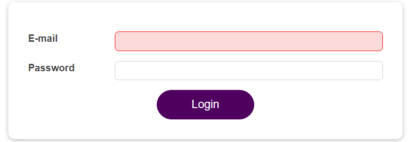

# Forward Refs (useImperativeHandle dan React.ForwardRef)

Untuk menjelaskan tentang `Forward Refs` ini mari kita lihat kasus dibawah ini:



Pada form diatas kita bisa lihat ketika ada error validasi seperti diatas ekspetasi kita adalah `focus` cursor akan langsung berpindah menuju input yang belum terisi inputannya.

Untuk melakukan hal ini lihatlah beberapa langkah dibawah ini:

## 1. Tambahkan Ref dan juga function untuk melakukan focus

Kita perlu menambahkan Ref dan function untuk melakukan focus didalam file `Input` seperti dibawah ini:

```tsx
    const inputRef = useRef();

    const activate = () => {
        inputRef.current.focus();
    };

    return(
        <input
            ref={inputRef}
            type={props.type}
            id={props.id}
            value={props.value}
            onChange={props.onChange}
            onBlur={props.onBlur}
        />
    )
```

## 2. Gunakan useImperativeHandle

Mungkin kita bertanya-tanya bahwa bagaimana function tersebut akan dipassing menuju parentnya ?

Jawabannya kita akan menggunakan sebuah function yang berasal dari react yaitu yang bernama `useImperativeHandle`.

`useImperativeHandle` menerima dua parameter yaitu ref dan juga function yang mengembalikan apa saja yang ingin diekspos terhadap parentnya.

```tsx
import React, { useImperativeHandle } from 'react';

const Input = (props, ref) => {

    useImperativeHandle(ref, () => {
        return {
            focus: activate
        };
    });
};
```

## 3. Wrap Component menggunakan React.forwardRef

Agar kode yang sudah tambahkan dapat bekerja kita perlu melakukan wrap komponen kita kedalam `React.forwardRef`.

```tsx
const Input = React.forwardRef((props, ref) => {

});
```

## 4. Contoh penggunaan forwardRef pada parent

Tambahkan ref pada setiap inputan yang digunakan:

```tsx
    const emailInputRef = useRef();
    const passwordInputRef = useRef();

    return(
        <Input
          ref={emailInputRef}
          id="email"
          label="E-mail"
          type="email"
          isValid={emailIsValid}
          value={emailState.value}
          onChange={emailChangeHandler}
          onBlur={validateEmailHandler}
        />
        <Input
          ref={passwordInputRef}
          id="password"
          label="Password"
          type="password"
          isValid={passwordIsValid}
          value={passwordState.value}
          onChange={passwordChangeHandler}
          onBlur={validatePasswordHandler}
        />
    )
```

Gunakan function focus pada parent

```tsx
    const submitHandler = (event) => {
        event.preventDefault();
        if(formIsValid){
        authCtx.onLogin(emailState.value, passwordState.value);
        } else if (!emailIsValid) {
        emailInputRef.current.focus();
        } else {
        passwordInputRef.current.focus();
        }
    };
```

### [Back To React Index](../../README.md)


