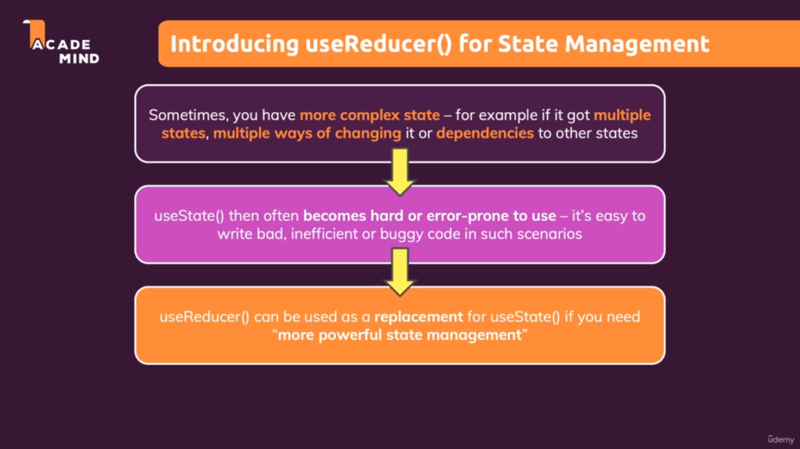
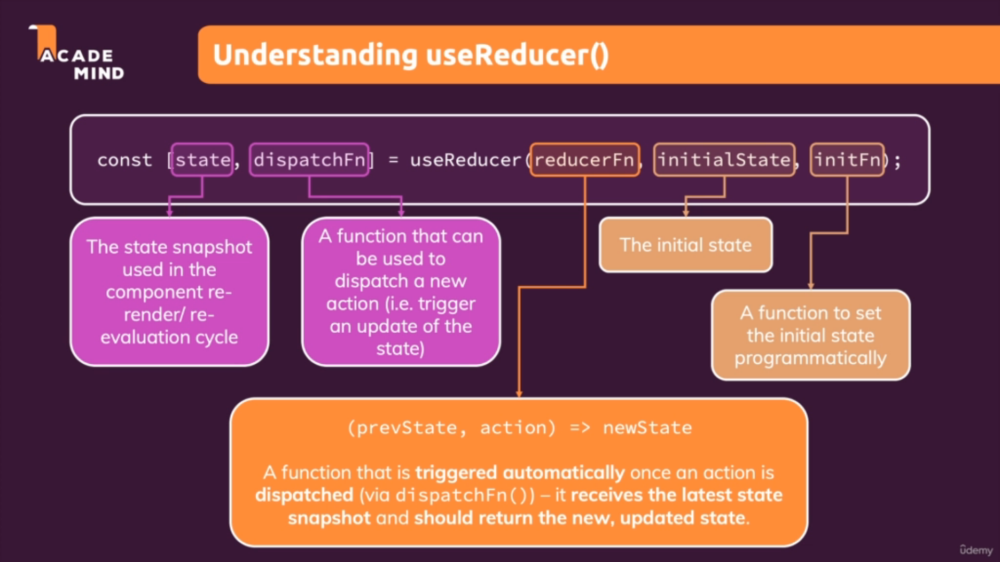

# Reducers

## 1. Perkenalan



Kita sudah mengenal yang namanya adalah useState dimana yaitu sebuah hook oleh react yang dapat membantu kita dalam state management didalam react. Tetapi bagaimana jika kita mempunyai state yang lebih complex yaitu seperti ketika ada multiple state, banyak cara untuk mengubah statesnya atau dependencies terhadap states lainnya. Hal ini membuat useState lebih susah untuk digunakan, tidak efisien dan buggy di beberapa scenario.

Kemudian diperkenalkan sebuah library baru yang bernama `useReducers` dimana adalah sebuah pengganti `useState` jika kita memerlukan sebuah state management yang lebih powerful. Walaupun nantinya kita tahu `useReducers` lebih powerful kita disarankan tidak selalu menggunakan `useReducers`, karena lebih powerful kita membutuhkan lebih banyak setup untuk menggunakannya.

Untuk Penulisan useReducer adalah seperti dibawah ini:



<br />

## 2. Contoh Kasus Penggunaan Reducers

Jadi seperti apakah contoh state yang lebih complex yang dimaksudkan didalam `useReducers`, lihatlah contoh dibawah ini:

```tsx
    const [enteredEmail, setEnteredEmail] = useState('');
    const [emailIsValid, setEmailIsValid] = useState();
    const [enteredPassword, setEnteredPassword] = useState('');
    const [passwordIsValid, setPasswordIsValid] = useState();
    const [formIsValid, setFormIsValid] = useState(false);
```

Kita bisa lihat diatas bahwa kita mempunyai 5 state yang sebenarnya berhubungan satu sama lain yaitu 

### a. enteredEmail dan emailIsValid 

enteredEmail dan emailIsValid berhubungan karena ketika user menuliskan email kita mengupdate state enteredEmail dan kita melakukan sebuah pengecekan menggunakan function dibawah:

```tsx
    const validateEmailHandler = () => {
        setEmailIsValid(enteredEmail.includes('@'));
    };
```

Kita tahu bahwa untuk melakukan update yang berhubungan dengan suatu state sebelumnya kita menggunakan `prevProps` tetapi pada kasus diatas kita menggunakan `dependencies` state lain (setState nya milik emailIsValid sedangkan state cek nya menggunakan enteredEmail) yang mungkin sangat jarang atau bahkan telat dalam update nilainya dan kita akan mendapat nilai yang tidak paling update.

### b. enteredPassword dan passwordIsValid 

enteredPassword dan passwordIsValid berhubungan karena ketika user menuliskan password kita mengupdate state enteredPassword dan kita melakukan sebuah pengecekan menggunakan function dibawah:

```tsx
    const validatePasswordHandler = () => {
        setPasswordIsValid(enteredPassword.trim().length > 6);
    };
```

Kita tahu bahwa untuk melakukan update yang berhubungan dengan suatu state sebelumnya kita menggunakan `prevProps` tetapi pada kasus diatas kita menggunakan `dependencies` state lain (setState nya milik passwordIsValid sedangkan state cek nya menggunakan enteredPassword) yang mungkin sangat jarang atau bahkan telat dalam update nilainya dan kita akan mendapat nilai yang tidak paling update.

### c. formIsValid

Sedangkan pada formIsValid kita lebih banyak menggunakan dependencies yaitu dua state yang bukan miliknya sehingga kita tidak bisa menggunakan `prevProps`

```tsx
    const emailChangeHandler = (event) => {
        setEnteredEmail(event.target.value);

        setFormIsValid(
        event.target.value.includes('@') && enteredPassword.trim().length > 6
        );
    };

    const passwordChangeHandler = (event) => {
        setEnteredPassword(event.target.value);

        setFormIsValid(
        enteredEmail.includes('@') && event.target.value.trim().length > 6
        );
    };
```

<br />


## 3. Penyelesaian menggunakan Reducer

Untuk menggunakan Reducer ada beberapa langkah yang harus kita lakukan yaitu:

### a. Lakukan Import Use Reducer

```ts
    import React, { useReducer } from 'react';
```

### b. Gunakan variabel Reducer

```ts
  const [emailState, dispatchEmail] = useReducer(first, second, third)
```

### c. Membuat Reducer Function Sebagai Argumen Pertama useReducer

Kita akan membuat sebuah `Reducer Function` yang nantinya akan digunakan sebagai parameter pada `useReducer` kita. Ada beberapa hal yang perlu diperhatikan dalam pembuatan `Reducer Function` ini yaitu function ini biasanya dibuat diluar komponen `userReducer` berada. Hal ini dikarenakan yang dilakukan didalam reducer function, kita tidak butuh sama sekali dengan data yang digenerate didalam komponen dimana useReducer berada. Sehingga kita bisa menuliskan Reducer Function ini diluar dari scope, karena kita tidak membutuhkan interaksi apapun dengan apapun yang ada didalam komponen function. Contoh:

```tsx
    // Reducer Function
    const emailReducer = (state, action) => {
    return { value: '', isValid: false}
    }

    // Component dimana useReducer berada
    const LoginComponent = () => {};
```

Reducer Function ini menerima dua parameter yaitu snapshot terbaru kita dan action yang akan di dispatch. Dan sebagai nilai return default dari `Reducer Function` ini adalah kita harus mengembalikan state baru yang biasanya adalah Object.

### d. Memberikan initialState sebagai Argumen Kedua useReducer

Kita dapat memberikan suatu nilai sebagai initialState dari variabel useReducer tersebut seperti dibawah ini:

```tsx
  const [emailState, dispatchEmail] = useReducer(emailReducer, {
    value: '',
    isValid: false,
  }, third)
```

### e. Memakai useReducer State

Karena state dalam useReducer berbentuk Object, dalam penggunaannya kita akan menggunakan seperti dibawah ini:

```tsx
    const [emailState, dispatchEmail] = useReducer(emailReducer, {
        value: '',
        isValid: false,
    }, third)

    const passwordChangeHandler = (event) => {
    setEnteredPassword(event.target.value);

    setFormIsValid(
      // emailState.isValid adalah state dari Reducer
      emailState.isValid && event.target.value.trim().length > 6
    );
  };
```

### f. Membuat dan memakai dispatch

Dalam pembuatan dispatch kita harus memperhatikan penulisannya, secara umum penulisan pemanggilan dispatch adalah `namaDispatch({type: 'type Action', val: 'value baru'})`. Argumen yang kita lempar adalah sebuah object yang berisi type actionnya dan value baru dari suatu state. Contohnya adalah dibawah ini:

```tsx
    const emailChangeHandler = (event) => {
        dispatchEmail({type: 'USER_INPUT', val: event.target.value});
    };
```

Kemudian pada function reducernya kita tambahkan suatu kondisi sesuai dengan tipe dari Actionnya:

```tsx
const emailReducer = (state, action) => {
  if(action.type === 'USER_INPUT'){
    return { value: action.val, isValid: action.val.includes('@')};
  }
  return { value: '', isValid: false}
}
```

Kita juga bisa melakukan dispatch tanpa suatu value, yang dimana kita akan menggunakan value yang tersimpan dalam aksi function kita. Lihatlah contoh dibawah ini:

```tsx
    const validateEmailHandler = () => {
        dispatchEmail({type: 'INPUT_BLUR'});
    };

    const emailReducer = (state, action) => {
        if(action.type === 'USER_INPUT'){
            return { value: action.val, isValid: action.val.includes('@')};
        }
        // dispatch action tanpa value baru kita bisa menggunakan state yang tersimpan sebagai data yang diproses
        if(action.type === 'INPUT_BLUR'){
            return { value: state.value, isValid: state.value.includes('@')}
        }
        return { value: '', isValid: false}
    }
```

### Kode Lengkap dari contoh penggunaan useReducer Diatas

```tsx
    // Reducer Function
    const emailReducer = (state, action) => {
        if(action.type === 'USER_INPUT'){
            return { value: action.val, isValid: action.val.includes('@')};
        }
        if(action.type === 'INPUT_BLUR'){
            return { value: state.value, isValid: state.value.includes('@')}
        }
        return { value: '', isValid: false}
    }

    const Login = (props) => {
        // useReducer
        const [emailState, dispatchEmail] = useReducer(emailReducer, {
            value: '',
            isValid: null,
        });

         const emailChangeHandler = (event) => {
            // Dispatch dengan value
            dispatchEmail({type: 'USER_INPUT', val: event.target.value});
        
            setFormIsValid(
            event.target.value.includes('@') && enteredPassword.trim().length > 6
            );
        };

        const validateEmailHandler = () => {
            // Dispatch tanpa value
            dispatchEmail({type: 'INPUT_BLUR'});
        };
    };
```

## 4. useReducer and useEffect

Perhatikanlah code dibawah ini:

```tsx
    const emailChangeHandler = (event) => {
        dispatchEmail({type: 'USER_INPUT', val: event.target.value});
    
        setFormIsValid(
        event.target.value.includes('@') && passwordState.isValid
        );
    };
```

Kita bisa lihat diatas bahwa untuk melakukan `setFormIsValid` kita melakukan pengecekan menggunakan state lain, yang walaupun hal tersebut sudah menggunakan reducer di kasus yang langka bisa dapat terjadi keterlembatan. Hal ini kita bisa hindari dengan menggunakan `useEffect` seperti dibawah ini:

```tsx
    useEffect(() => {
        // We give name to time out so we can reset it
        const identifier = setTimeout(() => {
        console.log('Checking Form Validity');
        setFormIsValid(
            emailState.isValid && passwordState.isValid
        );
        }, 500);
    

        // Syntax untuk clean up useEffect
        return(() => {
        console.log('This is Clean Up');
        //We Reset The Timer so We only user one timer
        clearTimeout(identifier);
        })
    }, [emailState, passwordState])
```

Dengan menggunakan `useEffect` ini kita mempastikan bahwa update `formIsValid` akan selalu terjadi ketika `emailState` dan `passwordState` mengalami perubahan.

Tetapi ada yang perlu diperhatikan dari kode dependensi useEffect diatas yaitu emailState dan passwordState adalah state dari `useReducer`. Kita perlu melakukan optimisasi lebih lanjut dikarenakan state tersebut berbentuk objek sehingga jika properties lain mengalami perubahan maka useEffect tersebut juga akan berjalan, sedangkan kita hanya penggunakan props yaitu `emailState.isValid` dan `passwordState.isValid`. Untuk melakukan hal ini kita akan melakukan destructuring dari kedua state reducer tersebut seperti dibawah ini:

```tsx
    // We do destructuring and give alias
    const { isValid: emailIsValid } = emailState;
    const { isValid: passwordIsValid } = passwordState;

    useEffect(() => {
        const identifier = setTimeout(() => {
        // We change the variable
        setFormIsValid(
            emailIsValid && passwordIsValid
        );
        }, 500);
    

        return(() => {
            clearTimeout(identifier);
        });
    }, [emailIsValid, passwordIsValid])
```

Dengan menggunakan props spesifik dari state `useReducer` yang ada akan mengoptimisasi lebih lanjut `useEffect` yang digunakan.