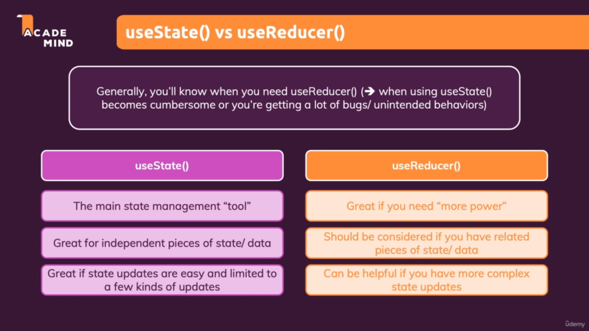

# useState VS useReducer

## Which one should you chose?
It is fairly straightforward to decide. Use useState if:

* The states are simple types such as boolean, string etc, or shallow objects (we need to set specific param in an object)
* There are only a handful you are managing
* State setters are not littered all over the place in your component.
Otherwise use useReducer.

### [Back To React Index](../../README.md)
